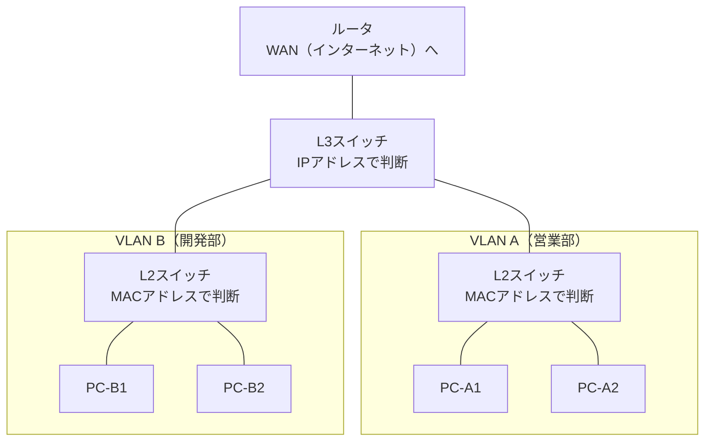

# L3スイッチ

## 概要
ルータ機能を内蔵したスイッチ。LAN内のVLAN同士をIPアドレスで接続する機器。

## 理解したこと

### 全体像

```mermaid
graph TD
    R["ルータ<br/>WAN（インターネット）へ"] --- L3["L3スイッチ<br/>IPアドレスで判断"]

    subgraph VLAN_A["VLAN A（営業部）"]
        L2A["L2スイッチ<br/>MACアドレスで判断"] --- A1[PC-A1]
        L2A --- A2[PC-A2]
    end

    subgraph VLAN_B["VLAN B（開発部）"]
        L2B["L2スイッチ<br/>MACアドレスで判断"] --- B1[PC-B1]
        L2B --- B2[PC-B2]
    end

    L3 --- L2A
    L3 --- L2B
```

社内ネットワークでVLAN同士をつなぐために、スイッチにルータ機能を詰め込んで生まれた機器。物理的にはL2スイッチ・ルータとは別の機器として存在する。

---

### L2スイッチとの違い

| | L2スイッチ | L3スイッチ |
|--|--|--|
| 判断基準 | MACアドレス | IPアドレス |
| 接続範囲 | 1つのVLAN（部署）内 | VLAN同士（部署間） |

---

### ルータとの違い

| | ルータ | L3スイッチ |
|--|--|--|
| 主戦場 | WAN（外部との接続） | LAN内 |
| 処理方式 | ソフトウェア処理 | ハードウェア処理＋定型化 |
| 処理速度 | 若干重い | 高速 |

社内ネットワークでは両者を役割分担して併用する（ルータ単体でL3スイッチの仕事を任せると処理が重すぎる）。

---

## 関連概念
- [hub_and_switch](hub_and_switch.md)（L2スイッチ・ハブとの対比元）
- [vlan](vlan.md)（L3スイッチが接続する論理分割の単位）
- [router](router.md)（同じL3転送の役割を担うが、WAN向けの汎用機器）
- [ip_address](ip_address.md)（判断基準となるアドレス）
- [mac_address](mac_address.md)（L2スイッチの判断基準として対比に登場するアドレス）

## ソース
- 2026-04-27：書籍「イラスト図解式ネットワークの基本」第4章
- 2026-04-27：https://eonet.jp/column/optical-line/layer3-switch.html

## タグ
L3スイッチ, ネットワーク, VLAN, LAN, ルータ, IPアドレス, ハードウェア処理
