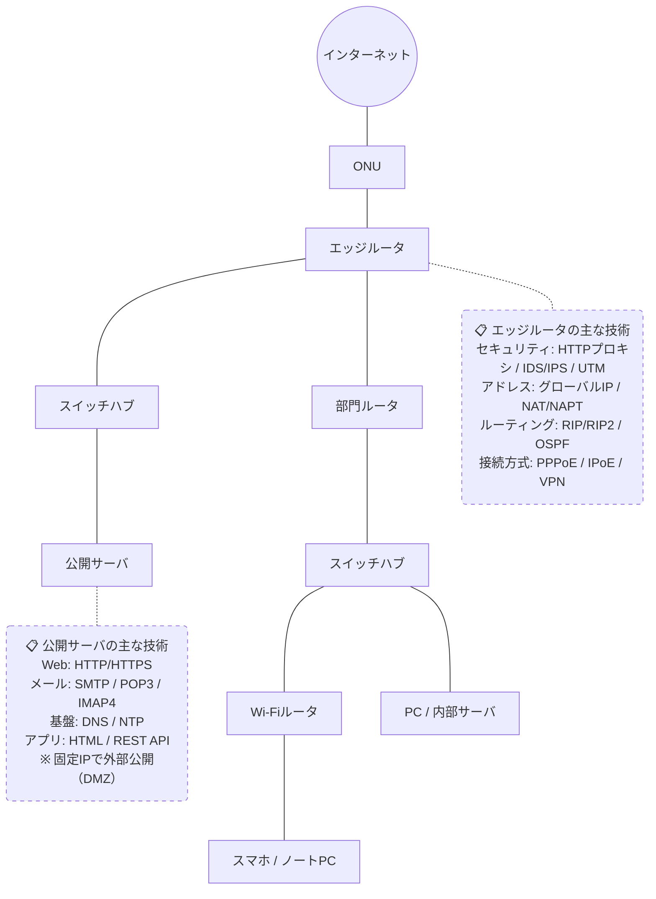

# LAN / WAN

## 概要
ネットワークの範囲による分類。LANは1拠点内、WANは拠点間を結ぶ。

## 理解したこと
- **LAN**（Local Area Network）：オフィス・家庭など1拠点内のネットワーク。PCとルータをLANケーブルやWiFiで接続
- **WAN**（Wide Area Network）：拠点と拠点を結ぶネットワーク。ONUから外はWAN
- ルータがLANとWANの境界に立つ
- LANとWANがつながって広がることでインターネットが形成される

## オフィスの経路（全体像）

## エッジルータ周辺の技術

| カテゴリ | 技術 |
|---------|------|
| セキュリティ | HTTPプロキシ, IDS/IPS, UTM/次世代FW |
| アドレス | グローバルIP, NAT/NAPT |
| ルーティング | RIP/RIP2, OSPF |
| 接続方式 | PPPoE, IPoE, VPN |

## DMZ（公開サーバゾーン）
- エッジルータ → スイッチハブ → 公開サーバ（固定IP）
- プロトコル：HTTP/HTTPS, SMTP/POP3/IMAP4, DNS, NTP
- アプリ層：HTML, REST API

## 内部ネットワーク
- 部門ルータ：DHCP でプライベートIPを配布
- PC/内部サーバ：イーサネット, IP, TCP/UDP, 暗号化, サブネット, Windowsドメイン
- スイッチハブ経由でWi-Fiルータも接続

## 関連概念
- internetworking.md
- utm.md

## ソース
- 2026-03-09・「イラスト図解式 ネットワークの基本」第1章
- 2026-03-30・「イラスト図解式 ネットワークの基本」第1章（各層の技術詳細・Mermaid図を追記）

## タグ
ネットワーク, LAN, WAN, インフラ, DMZ, エッジルータ, DHCP
