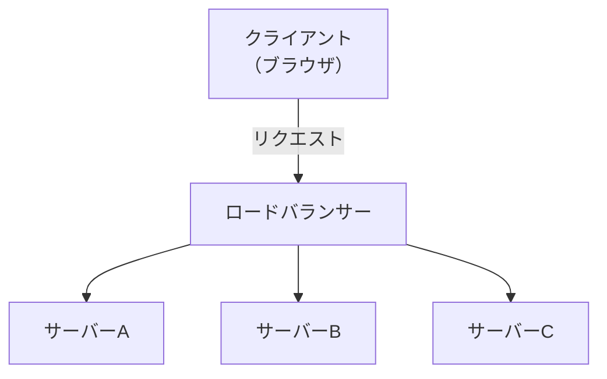

# ロードバランサー

## 概要
アクセスを複数のサーバーに分散するための機器・ソフトウェア。可用性とスケーラビリティの確保に使う。

## 理解したこと

### 振り分けアルゴリズム
- **ラウンドロビン**：サーバーに順番に均等に振る
- **最小コネクション（リースト）**：現在の接続数が最も少ないサーバーに振る
- **IPハッシュ**：同じIPアドレスのユーザーを常に同じサーバーに固定する

### メリット
- **冗長化（可用性）**：一部サーバーが故障してもサービスを継続できる
- **スケールアウト（拡張性）**：サーバーを増やすだけで処理能力を上げられる

### 基本アーキテクチャ

### セッション管理との関係
リクエストが毎回異なるサーバーに振られるため、サーバー内にログイン状態を持つ設計だと強制ログアウトが起きる。
詳細は `session_management.md` を参照。

## 関連概念
- session_management.md
- ssl_tls.md

## ソース
- 書籍：イラスト図解式ネットワークの基本　第5章（2026-05-14）

## タグ
ネットワーク, インフラ, 可用性, スケールアウト, 冗長化
