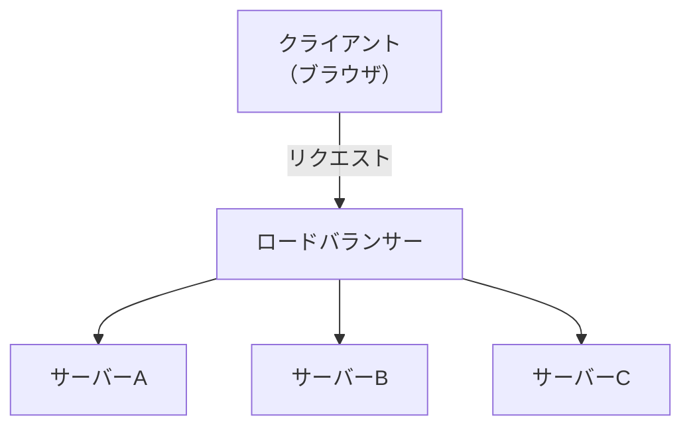

# ロードバランサー

## 概要
アクセスを複数のサーバーに分散するための機器・ソフトウェア。可用性とスケーラビリティの確保に使う。

## 理解したこと

### 振り分けアルゴリズム
- **ラウンドロビン**：サーバーに順番に均等に振る
- **最小コネクション（リースト）**：現在の接続数が最も少ないサーバーに振る
- **IPハッシュ**：同じIPアドレスのユーザーを常に同じサーバーに固定する

### メリット
- **冗長化（可用性）**：一部サーバーが故障してもサービスを継続できる
- **スケールアウト（拡張性）**：サーバーを増やすだけで処理能力を上げられる

### 基本アーキテクチャ

```mermaid
graph TD
    Client["クライアント<br/>（ブラウザ）"]
    LB["ロードバランサー"]
    A["サーバーA"]
    B["サーバーB"]
    C["サーバーC"]

    Client -->|リクエスト| LB
    LB --> A
    LB --> B
    LB --> C
```

### セッション消失問題
ロードバランサーが異なるサーバーにリクエストを振ると、前のサーバーが持っていたセッション情報が引き継がれず強制ログアウトが起きる。

**解決策1：IPハッシュによるセッション固定**

同一ユーザーを常に同じサーバーに振ることでセッションを維持する。

弱点：NATで複数ユーザーが同一IPを共有する場合に負荷が偏る・サーバー追加時に再配置が起きる。

解決策2以降（外部セッションストア・Redis SPOF・JWT）は `session_management.md` を参照。

---

## 関連概念
- session_management.md（セッション消失問題の解決策2以降：外部ストア・Redis・JWTの設計）
- redis.md（セッション消失問題の解決策2で使う外部ストア）
- ssl_tls.md

## ソース
- 書籍：イラスト図解式ネットワークの基本　第5章（2026-05-14）

## タグ
ネットワーク, インフラ, 可用性, スケールアウト, 冗長化
