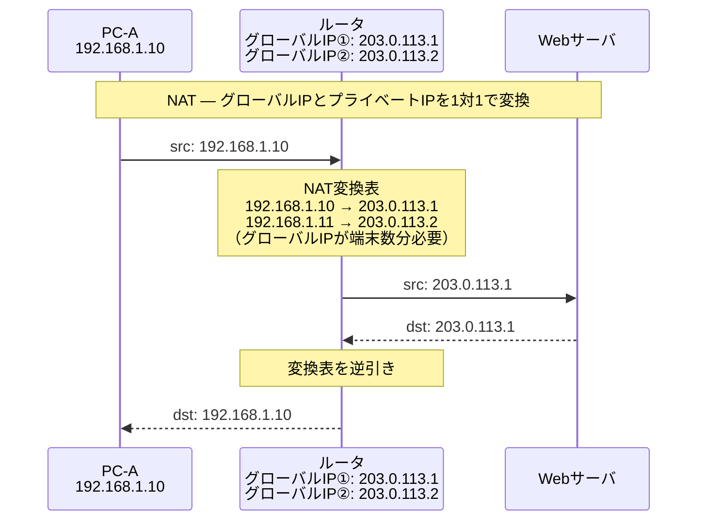
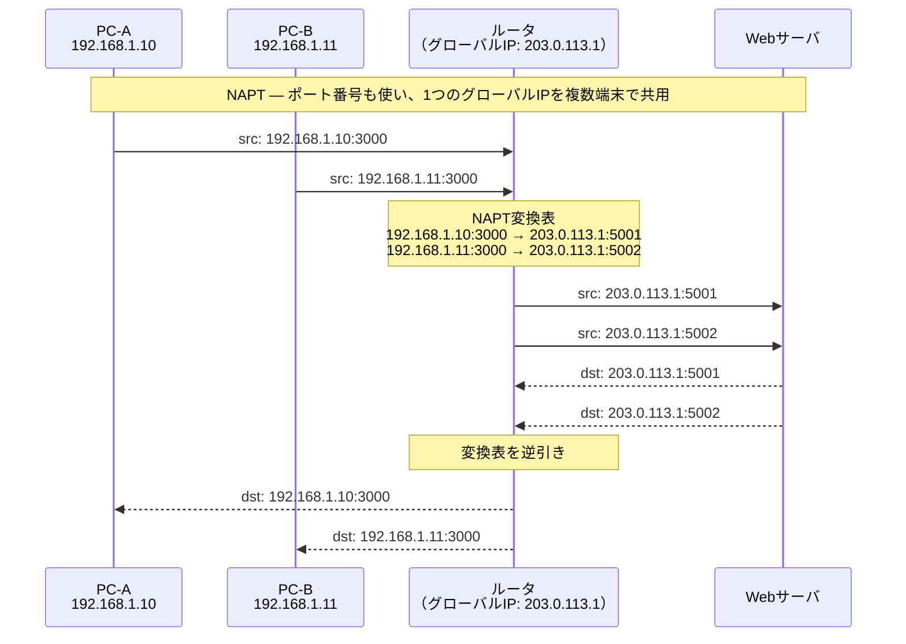

# NAT / NAPT

## 概要
プライベートIPアドレスとグローバルIPアドレスを相互変換することで、LAN内の端末がインターネットと通信できるようにする技術。

## 理解したこと

### NAT（Network Address Translation）
- ルータにグローバルIPアドレスを保持しておき、LAN→インターネットのパケット転送時にプライベートIPをグローバルIPに付け替える
- 1対1の変換のため、同時接続できる端末数はルータが保持するグローバルIPの数に限られる

### NAPT（Network Address Port Translation）
- IPアドレスの変換に加えてポート番号も付け替えることで、1つのグローバルIPを複数端末で共用できる
- ルータはプライベートIP＋ポート番号 ↔ グローバルIP＋ポート番号の対応表を管理する
- 対応表は「内→外」の通信を起点に動的に作られる
- NATと違い、複数端末が**同時に**インターネット通信できる（ポートで識別するため）

### ポート番号の詳細（送信元と宛先）

パケットには送信元・宛先の両方にポート番号が存在する。

| | 送信元ポート | 宛先ポート |
|---|---|---|
| クライアント→サーバ | ランダム自動割り当て（1024以降） | 固定（HTTP=80, HTTPS=443 等） |
| サーバ→クライアント | 固定（80等） | クライアントの送信元ポート |

NAPTが管理するのは**クライアント側の送信元ポート**。ルータが独自のポート番号に付け替えて変換テーブルに記録する。

```
送り出し時のパケット（PC-A）
├── 送信元IP:    192.168.1.10 → 203.0.113.1（グローバルIPに書き換え）
├── 送信元ポート: 3000 → 5001（ルータが付け替え）
├── 宛先IP:      Webサーバ
└── 宛先ポート:   80（そのまま）

送り出し時のパケット（PC-B）
├── 送信元IP:    192.168.1.11 → 203.0.113.1（同じグローバルIPに書き換え）
├── 送信元ポート: 3000 → 5002（ルータが別の番号に付け替え）
├── 宛先IP:      Webサーバ
└── 宛先ポート:   80（そのまま）
```

PC-AとPC-Bが偶然同じ送信元ポートを使っていても、ルータが別の番号に付け替えるため重複しない。
プライベートIPはパケット内には存在せず、ルータの変換テーブル内にのみ保持される。

### NAPTの限界と解決策
- 対応表は内から外への通信で初めて作られるため、外から先に通信が来ても転送先がわからない
- 解決策①：NATを使う（1対1なので外からも届く）
- 解決策②：ポートフォワーディング（静的NAPT）— あらかじめ「グローバルIPのXXポート → LAN内の特定端末:YYポート」を固定登録しておく

## 構成図

### NAT（1対1変換）

<!-- 2026-04-17：イラスト図解式ネットワークの基本 第3章 -->


### NAPT（多対1変換）



## 関連概念
- ip_address.md
- lan_wan.md
- router.md

## ソース
- 2026-04-17：イラスト図解式ネットワークの基本 第3章

## タグ
NAT, NAPT, アドレス変換, グローバルIP, プライベートIP, ポートフォワーディング, ルータ
