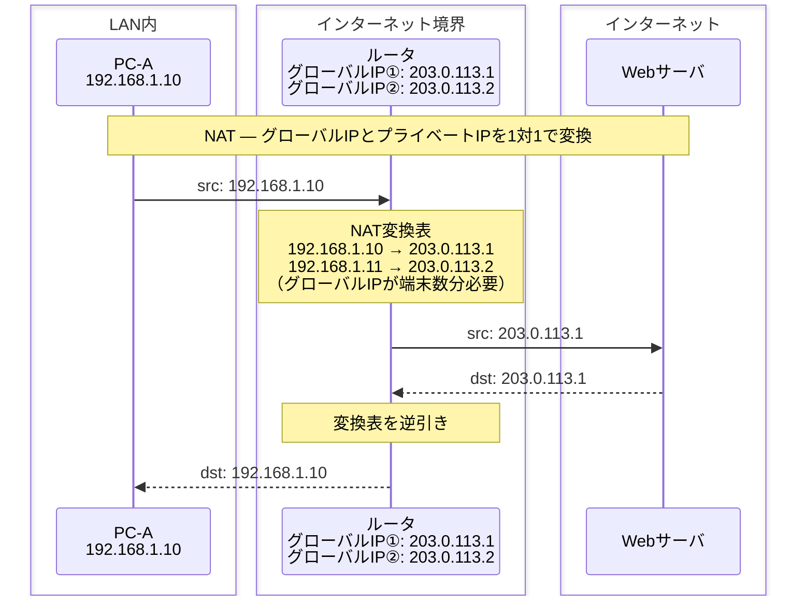
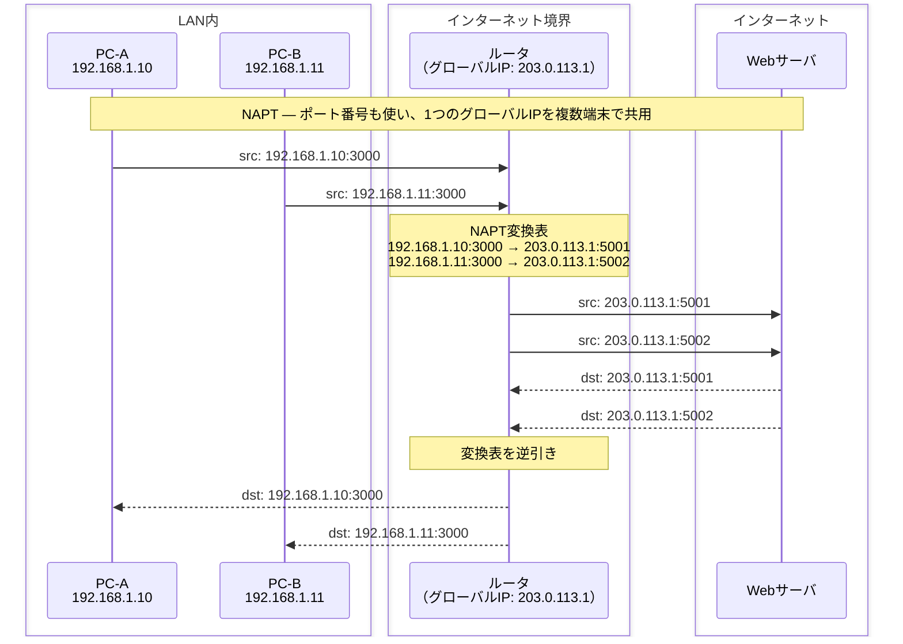

# NAT / NAPT

## 概要
プライベートIPアドレスとグローバルIPアドレスを相互変換することで、LAN内の端末がインターネットと通信できるようにする技術。

## 理解したこと

### NAT（1対1変換）

| | 内容 |
|---|---|
| 仕組み | ルータがグローバルIPを保持し、LAN→インターネット時にプライベートIPをグローバルIPに付け替える |
| 制約 | 1対1変換のため、同時接続できる端末数はルータが保持するグローバルIPの数に限られる |


```mermaid
sequenceDiagram
    box LAN内
    participant A as PC-A<br/>192.168.1.10
    end
    box インターネット境界
    participant R as ルータ<br/>グローバルIP①: 203.0.113.1<br/>グローバルIP②: 203.0.113.2
    end
    box インターネット
    participant W as Webサーバ
    end

    Note over A,W: NAT — グローバルIPとプライベートIPを1対1で変換
    A->>R: src: 192.168.1.10
    Note over R: NAT変換表<br/>192.168.1.10 → 203.0.113.1<br/>192.168.1.11 → 203.0.113.2<br/>（グローバルIPが端末数分必要）
    R->>W: src: 203.0.113.1
    W-->>R: dst: 203.0.113.1
    Note over R: 変換表を逆引き
    R-->>A: dst: 192.168.1.10
```

---

### NAPT（多対1変換）

| | 内容 |
|---|---|
| 仕組み | IPアドレスに加えてポート番号も付け替え、1つのグローバルIPを複数端末で共用する |
| 変換表 | プライベートIP＋ポート番号 ↔ グローバルIP＋ポート番号の対応を管理 |
| 作成タイミング | 内→外の通信を起点に動的に生成される |
| NATとの違い | ポートで端末を識別するため、複数端末が同時にインターネット通信できる |


```mermaid
sequenceDiagram
    box LAN内
    participant A as PC-A<br/>192.168.1.10
    participant B as PC-B<br/>192.168.1.11
    end
    box インターネット境界
    participant R as ルータ<br/>（グローバルIP: 203.0.113.1）
    end
    box インターネット
    participant W as Webサーバ
    end

    Note over A,W: NAPT — ポート番号も使い、1つのグローバルIPを複数端末で共用
    A->>R: src: 192.168.1.10:3000
    B->>R: src: 192.168.1.11:3000
    Note over R: NAPT変換表<br/>192.168.1.10:3000 → 203.0.113.1:5001<br/>192.168.1.11:3000 → 203.0.113.1:5002
    R->>W: src: 203.0.113.1:5001
    R->>W: src: 203.0.113.1:5002
    W-->>R: dst: 203.0.113.1:5001
    W-->>R: dst: 203.0.113.1:5002
    Note over R: 変換表を逆引き
    R-->>A: dst: 192.168.1.10:3000
    R-->>B: dst: 192.168.1.11:3000
```

---

### ポート番号の詳細（送信元と宛先）

パケットには送信元・宛先の両方にポート番号が存在する。

| | 送信元ポート | 宛先ポート |
|---|---|---|
| クライアント→サーバ | ランダム自動割り当て（1024以降） | 固定（HTTP=80, HTTPS=443 等） |
| サーバ→クライアント | 固定（80等） | クライアントの送信元ポート |

NAPTが管理するのは**クライアント側の送信元ポート**。

ルータが独自のポート番号に付け替えて変換テーブルに記録する。

```
送り出し時のパケット（PC-A）
├── 送信元IP:    192.168.1.10 → 203.0.113.1（グローバルIPに書き換え）
├── 送信元ポート: 3000 → 5001（ルータが付け替え）
├── 宛先IP:      Webサーバ
└── 宛先ポート:   80（そのまま）

送り出し時のパケット（PC-B）
├── 送信元IP:    192.168.1.11 → 203.0.113.1（同じグローバルIPに書き換え）
├── 送信元ポート: 3000 → 5002（ルータが別の番号に付け替え）
├── 宛先IP:      Webサーバ
└── 宛先ポート:   80（そのまま）
```

PC-AとPC-Bが偶然同じ送信元ポートを使っていても、ルータが別の番号に付け替えるため重複しない。

プライベートIPはパケット内には存在せず、ルータの変換テーブル内にのみ保持される。

---

### NAPTの限界と解決策

対応表は内→外の通信で初めて作られるため、外から先に通信が来ても転送先がわからない。

| 解決策 | 内容 |
|---|---|
| NATを使う | 1対1変換なので外からも届く |
| ポートフォワーディング（静的NAPT） | あらかじめ「グローバルIPのXXポート → LAN内の特定端末:YYポート」を固定登録しておく |

---

## 関連概念
- ip_address（変換対象となるグローバルIP・プライベートIPの体系）
- lan_wan（NATが境界となるLANとWANの関係）
- router（NAT/NAPTを実行するネットワーク機器）

## ソース
- 2026-04-17：イラスト図解式ネットワークの基本 第3章

## タグ
NAT, NAPT, アドレス変換, グローバルIP, プライベートIP, ポートフォワーディング, ルータ
