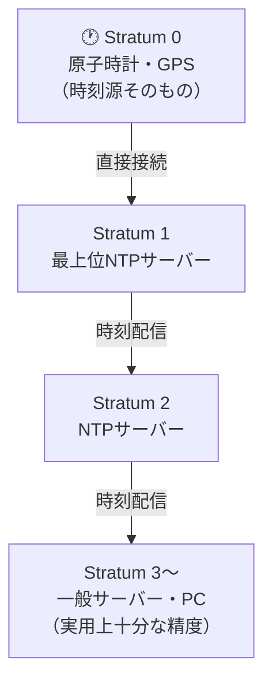

# NTP（Network Time Protocol）

## 概要
ネットワーク上のコンピュータ間で時刻を同期するためのプロトコル。UDP 123番ポートを使用する。

## 理解したこと

### なぜ時刻同期が必要か
- **ログの相関**: 複数サーバーのログ時刻がズレていると、障害時の原因特定が困難になる
- **セキュリティ**: SSL/TLS証明書の有効期限チェック、Kerberosなど時刻に敏感な認証プロトコルの正常動作に不可欠

### Stratum（階層構造）
負荷分散と精度維持のために階層構造を採用している。

| Stratum | 説明 |
|---------|------|
| 0 | 原子時計・GPSなどの時刻源そのもの |
| 1 | Stratum 0に直接接続された最上位サーバー |
| 2, 3... | 上位から時刻を受け取るサーバー。数値が大きいほど時刻源から遠い |

実用上はStratum 3〜4程度でも十分な精度が得られる。

### 時刻修正の2方式

**Step調整**
- 現在時刻から正しい時刻へ一気にジャンプする
- 「時間の逆行」が起き、Cronの重複実行やDBの整合性エラーを引き起こす可能性がある
- 稼働中のサーバーでは原則使わない

**Slew（スルー）調整**
- 1秒あたり最大0.5ms（500ppm）のペースでゆっくり時刻を寄せていく
- 1秒のズレなら約33分かけて修正する
- アプリから見て時刻変化が目立たないため、稼働中サーバーでの標準的な方法

### パケット交換の仕組み（本書未掲載・補足）
クライアントとサーバーが4つのタイムスタンプ（送信・受信・送信・受信）を交換し、往復の遅延を計算して差し引くことで、ネットワーク遅延があっても正確な時刻を算出できる。

## 関連概念
- kerberos（時刻に敏感な認証プロトコル）
- udp（使用するトランスポート層プロトコル）

## ソース
- 2026-05-11・書籍「イラスト図解式 ネットワークの基礎」第5章

## タグ
NTP, 時刻同期, Stratum, Slew, Step, ネットワーク, プロトコル, UDP
