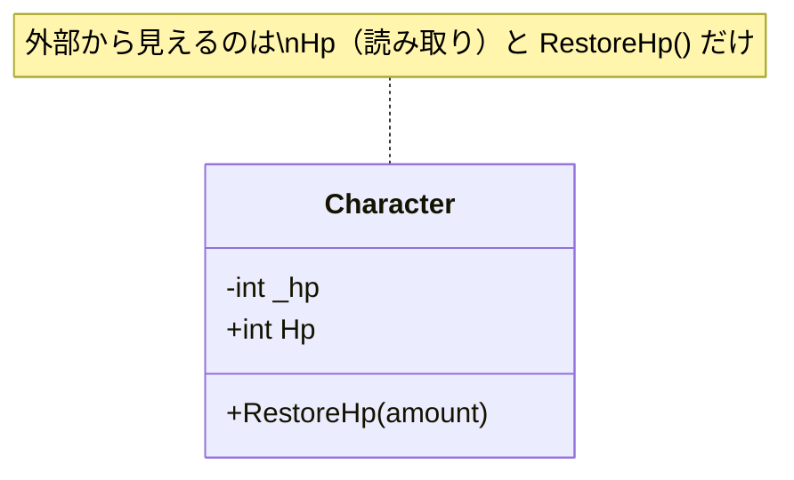

# OOPカプセル化

## 概要
オブジェクトの内部データを隠蔽し、外部からのアクセスを「公式の窓口（メソッド・プロパティ）」のみに制限する設計原則。

## フィールドとプロパティ

| | フィールド | プロパティ |
|---|---|---|
| 記述例 | `private int _hp;` | `public int Hp { get; private set; }` |
| アクセス制御 | 単一の修飾子のみ | get / set ごとに個別設定可 |
| 用途 | クラス内部の単純な変数 | 外部への公開・制御が必要な値 |
| 命名慣習（C#） | `_camelCase` | `PascalCase` |

## アクセス修飾子

| 修飾子 | 同クラス | サブクラス | 外部 |
|---|---|---|---|
| `public` | ○ | ○ | ○ |
| `protected` | ○ | ○ | × |
| `private` | ○ | × | × |

## アクセサごとの制御（プロパティの強み）

```csharp
public int Hp { get; private set; }  // 読み取りは公開、書き込みはクラス内のみ

public void RestoreHp(int amount) {
    Hp = Math.Min(Hp + amount, MaxHp);  // 内部からだけ書き込める
}
```

`hero.Hp = 9999;` は外部からコンパイルエラー。公式窓口（RestoreHp）を通すことで不正値を防ぐ。

## 構造図



## 関連概念
- inheritance
- oop_interface
- solid_principles

## ソース
- 2026-05-17：会話ベースの整理（C# .NET を題材に）

## タグ
カプセル化, OOP, C#, アクセス修飾子, フィールド, プロパティ
