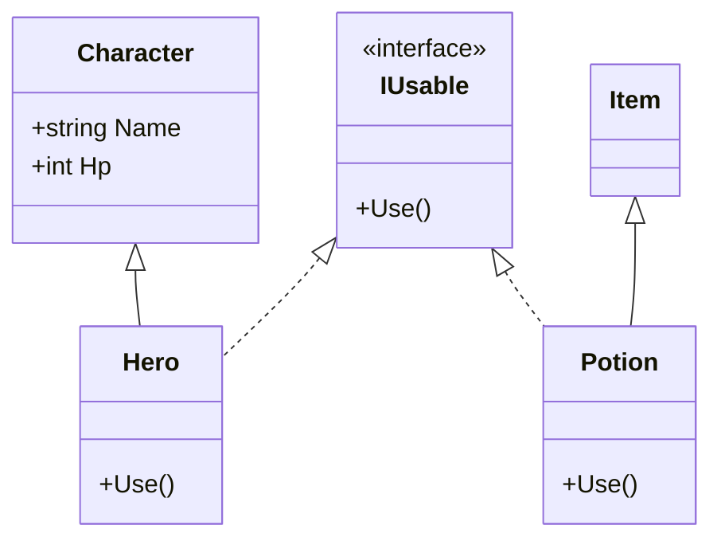
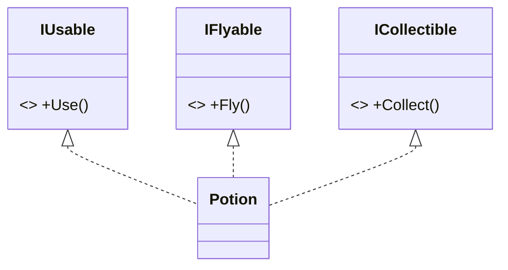

# インターフェース（OOP）

## 概要
血統（継承ツリー）と無関係に「～ができる（Can-do関係）」という能力・役割を定義する契約。

## 定義と実装

```csharp
// 定義：署名のみ（実装なし）
interface IUsable {
    void Use();
}

// 実装：署名通りのメソッドを必ず実装する
class Potion : IUsable {
    public void Use() { Console.WriteLine("HPを回復！"); }
}

class Scroll : IUsable {
    public void Use() { Console.WriteLine("魔法を発動！"); }
}
```

## 横のつながり

異なる家系でも、インターフェースを通じて同じ役割を持てる。



## 複数インターフェースの実装

継承は1つしか持てないが、インターフェースは何個でも実装できる。

```csharp
class Potion : IUsable, IFlyable, ICollectible { ... }
```



## 依存性の排除

呼び出し側が具体的な型を知らなくても動ける。

```csharp
List<IUsable> items = new List<IUsable> { new Potion(), new Scroll() };
foreach (IUsable item in items) {
    item.Use();  // 実体が何であれ Use() が呼ばれる
}
```

新しいアイテム（例: `Bomb`）が増えても `IUsable` を実装するだけで、呼び出し側の変更は不要。

## ポリモーフィズムの土台として

インターフェースは**ポリモーフィズムの前提条件**を作る。

| 役割 | 担当 |
|---|---|
| 「Use() を持つ」という型の契約 | インターフェース |
| 実体によって振る舞いが自動的に変わる | ポリモーフィズム |

インターフェースが `IUsable` という型を統一することで、呼び出し側は実体が `Potion` か `Bomb` かを知らなくていい。そこで初めてポリモーフィズムが機能する。

→ [polymorphism.md](polymorphism.md)

## 継承との使い分け

| | 継承（abstract含む） | インターフェース |
|---|---|---|
| 関係性 | Is-a（〜の一種） | Can-do（〜ができる） |
| 方向 | 縦のつながり | 横のつながり |
| 親の数 | 1つまで | 複数可 |
| 状態（フィールド） | 持てる | 持てない |

## 命名慣習
`I + 動詞able` の形が多い（IUsable, ISaveable, IAttackable）

## 関連概念
- inheritance
- polymorphism
- dependency_inversion

## ソース
- 2026-05-17：会話ベースの整理（C# .NET を題材に）

## タグ
インターフェース, OOP, C#, Can-do, Is-a, 依存性
