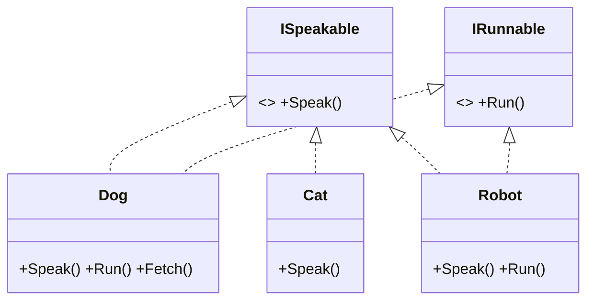

# インターフェース（OOP）

## 概要
血統（継承ツリー）と無関係に「～ができる（Can-do関係）」という能力・役割を定義する契約。変数やリストの「型」として使えるが、実体は作れない抽象型。

## 理解したこと

### 定義と実装

インターフェースは「署名（約束）だけ」を持ち、中身は持たない。

```csharp
interface ISpeakable {
    void Speak(); // 中身なし。Speakできることの約束だけ
}

// 実装：中身を初めて自分で書く（overrideではない）
class Dog : ISpeakable {
    public void Speak() => Console.WriteLine("ワン！");
}
```

**実装はoverrideではない。**

| | override | インターフェース実装 |
|---|---|---|
| 親に中身があるか | ある（親が実装済み） | ない（定義だけ） |
| やること | 親の実装を上書き | 約束の中身を初めて書く |

---

### インターフェースは「実体を持てない抽象型」

「型である」とは、変数・リストの型として使えるという意味。ただし自分自身のインスタンスは作れない。

```csharp
new ISpeakable()           // コンパイルエラー。実体を作れない
ISpeakable dog = new Dog() // OK。型はISpeakable、実体はDog
```

| 種類 | 例 |
|---|---|
| 値型 | int, bool, struct |
| 参照型 | class, **interface**, delegate |

インターフェースは参照型の一種。

---

### 「実装する」と「型として使う」は別の話

| | 誰の話 | 何の話 |
|---|---|---|
| **実装する** | 作る側（クラス） | 「この型の仲間です」と登録する行為 |
| **型として使う** | 使う側 | 「仲間ならまとめて扱える入れ物」を作る行為 |

この2つが揃って初めてポリモーフィズムが成立する。

---

### 型で見える範囲が決まる

変数の型がアクセスできる範囲を決める。実体が何かは関係ない。

```csharp
Dog dog1        = new Dog(); // 変数の型: Dog       → Speak()もFetch()も見える
ISpeakable dog2 = new Dog(); // 変数の型: ISpeakable → Speak()しか見えない
```

実体は同じ `Dog` のインスタンス。型が違うだけで見える世界が変わる。

```csharp
dog2.Speak();  // OK
dog2.Fetch();  // コンパイルエラー。ISpeakableにFetch()は定義されていない
```

---

### 横のつながり

異なる家系でも、インターフェースを通じて同じ役割を持てる。


```mermaid
classDiagram
    class ISpeakable { <<interface>> +Speak() }
    class IRunnable  { <<interface>> +Run() }
    class Dog   { +Speak() +Run() +Fetch() }
    class Cat   { +Speak() }
    class Robot { +Speak() +Run() }
    ISpeakable <|.. Dog
    ISpeakable <|.. Cat
    ISpeakable <|.. Robot
    IRunnable  <|.. Dog
    IRunnable  <|.. Robot
```

`Dog` と `Robot` は継承関係なし。インターフェースという横のつながりだけで同じリストに入れられる。

---

### 複数インターフェースの実装

継承は1つだけだが、インターフェースは何個でも実装できる。

```csharp
class Dog : ISpeakable, IRunnable { ... }
```

---

### 型としてまとめて扱う

```csharp
// ISpeakableを実装していれば、血縁なしでも同じリストに入れられる
List<ISpeakable> all = new List<ISpeakable> { new Dog(), new Cat(), new Robot() };
foreach (var s in all) { s.Speak(); }

// IRunnableを実装しているのはDogとRobotだけ → Catは入れられない
List<IRunnable> runners = new List<IRunnable> { new Dog(), new Robot() };
foreach (var r in runners) { r.Run(); }
```

---

### 継承との使い分け

| | 継承（abstract含む） | インターフェース |
|---|---|---|
| 関係性 | Is-a（〜の一種） | Can-do（〜ができる） |
| 方向 | 縦のつながり | 横のつながり |
| 親の数 | 1つまで | 複数可 |
| 状態（フィールド） | 持てる | 持てない |

---

### 命名慣習

`I + 動詞able` の形が慣習（`ISpeakable`, `IRunnable`, `IUsable`）。
`IAnimal` のような名詞形はスーパークラスっぽく見えるのでNG。

---

## 関連概念
- inheritance（継承は縦のIs-a関係。インターフェースの横のCan-do関係と対をなす）
- polymorphism（インターフェースはポリモーフィズムの前提条件。型を統一することで実体が何かを意識せず扱える）

## ソース
- 2026-05-17：会話ベースの整理（C# .NET を題材に）
- 2026-06-04：/code セッション（csharp_interface）

## タグ
インターフェース, OOP, C#, Can-do, Is-a, 依存性, ポリモーフィズム, 抽象型
