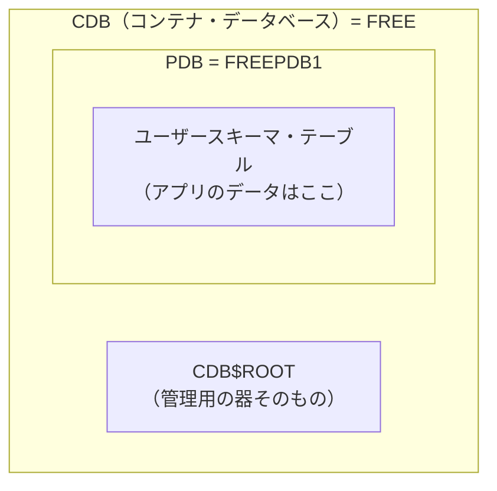

# Oracle CDB/PDB（マルチテナント構成）

## 概要
Oracle 12c以降のデフォルト構成では、1つのCDB（コンテナ・データベース）の中に複数のPDB（プラガブル・データベース）が入れ子になっており、実際のアプリのスキーマ・テーブルはPDB側に作る。

## 理解したこと

### CDBとPDBの入れ子構造

CDBは複数のPDBを内包できる「入れ物」。

`gvenzl/oracle-free`イメージはデフォルトで`FREE`（CDB）と`FREEPDB1`（PDB）を1つずつ持つ。

---

### なぜ`FREE`に繋ぐと`ORA-65096`になるか

`FREE`はCDB rootそのもの。

CDB rootに直接繋いだ状態で通常の名前（`data_schema`など）の`CREATE USER`を実行すると、Oracleは「共通ユーザーの命名規則（`C##`接頭辞）に従っていない」と判断し`ORA-65096`で弾く。

| 接続先 | Service Name | 通常の`CREATE USER`名 |
|---|---|---|
| CDB root | `FREE` | ✕（`C##`接頭辞が必要） |
| PDB | `FREEPDB1` | ○（そのまま使える） |

アプリ用のユーザー・テーブルはPDB側に作るのが通常の運用のため、`FREEPDB1`を指定する。

---

## 関連概念
- dbms（DBMSインスタンスとデータベースの管理単位という文脈で繋がる）

## 関連実装
- [mac_linux_db_connection](../coding/mac_linux_db_connection/) — `FREEPDB1`指定・`ORA-65096`回避を含むDocker上でのOracle接続実験

## ソース
- 2026-08-22〜2026-08-24・Mac↔Linux DB接続実験（Oracle Database Free on Docker, note/2026-08-22.md, note/2026-08-24.md）

## タグ
Oracle, CDB, PDB, マルチテナント, ORA-65096, プラガブルデータベース, コンテナデータベース
