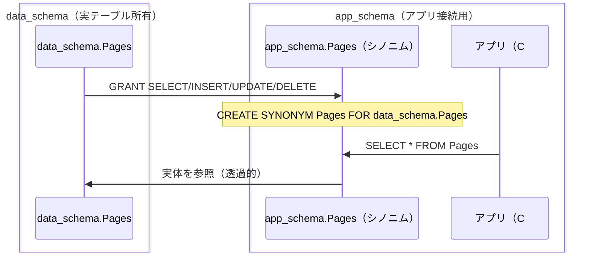

# Oracleのスキーマ分離（ユーザー・GRANT・シノニム）

## 概要
Oracleでは「ユーザー」を作ることがそのまま「スキーマ」を作ることを意味する。実テーブルを持つスキーマとアプリが接続するスキーマを分け、GRANTで権限を渡し、シノニムで透過的に参照させることで、アプリ側から実テーブルの所有・配置を隠蔽できる。

## 理解したこと

### ユーザー＝スキーマという前提

Oracleでは`CREATE USER`した瞬間、そのユーザー名と同名の**スキーマ**が同時に生まれる。

ユーザーとスキーマが別概念（`CREATE SCHEMA`と`CREATE ROLE/USER`が独立している）なPostgreSQLなどとは前提が異なる。

このため「どのユーザーで接続して`CREATE TABLE`を実行したか」が、そのままテーブルの所有スキーマを決める。

---

### 実際に起きたつまずき

`data_schema`用のテーブルのつもりで`CREATE TABLE Pages`を実行したが、実際は`SYSTEM`ユーザーで接続したままだったため`SYSTEM`スキーマにテーブルができてしまった。

| 状況 | 接続ユーザー | `Pages`の所有スキーマ |
|---|---|---|
| 想定 | `data_schema` | `data_schema` |
| 実際 | `system` | `system` |

`DROP TABLE SYSTEM.Pages;`で削除し、`data_schema`専用の接続を新規に作って`CREATE TABLE`をやり直すことで解決した。

SQL Developerの接続先を毎回確認する必要がある。

---

### スキーマ分離の全体構成

実テーブルを持つ`data_schema`と、アプリが接続する`app_schema`を分け、`GRANT`と`SYNONYM`で橋渡しする。

アプリは`app_schema.Pages`という同じ名前でアクセスするだけで、裏側の実テーブルが`data_schema`のどこにあるかを意識しない。

---

### GRANTとシノニムの役割分担

| 要素 | 役割 |
|---|---|
| `GRANT` | `data_schema`が`app_schema`に対し、オブジェクト単位で操作権限（SELECT/INSERT/UPDATE/DELETE）を許可する。権限がなければシノニム越しでもアクセス不可 |
| `SYNONYM` | `app_schema`側から見た「別名」。`app_schema.Pages`と書くだけで`data_schema.Pages`を指す。実テーブルの所在をアプリから隠す |

シノニムだけでは意味がなく、必ずGRANTとセットで機能する。

権限がない状態でシノニムだけ作っても、参照時にエラーになる。

---

### 識別子の大文字小文字

Oracleの識別子（ユーザー名・テーブル名など）はクォートなしで書くと自動的に大文字化される。

| 操作 | 大文字小文字の扱い |
|---|---|
| SQL文中の識別子（`CREATE USER data_schema`） | 自動で`DATA_SCHEMA`に変換される |
| SQL Developerの接続ユーザー名欄 | 識別子として解釈されるため小文字でも一致する |
| SQL Developerのスキーマフィルタ検索欄 | 単純な文字列一致のため、大文字で入力しないとヒットしない |

同じ「小文字入力」でも、Oracleの識別子解釈を経由するかどうかでヒットする・しないが分かれる、という点がハマりどころだった。

---

## 関連概念
- three_layer_schema（概念スキーマ内でビューによって別名を与える発想と近いが、3層スキーマがDBMS管理の自動マッピングなのに対し、スキーマ分離は人間が明示的にGRANT/SYNONYMを設定する点が異なる）
- dbms（GRANTなどの権限管理はDBMSが担う機能の一部）

## 関連実装
- [mac_linux_db_connection](../coding/mac_linux_db_connection/) — `data_schema`/`app_schema`の作成・GRANT・シノニム作成を実際に構築した実験

## ソース
- 2026-08-22〜2026-08-24・Mac↔Linux DB接続実験（Phase 0: スキーマ分離、note/2026-08-22.md, note/2026-08-24.md）

## タグ
Oracle, スキーマ, GRANT, シノニム, 権限管理, DCL, スキーマ分離, ユーザー, データ独立性
