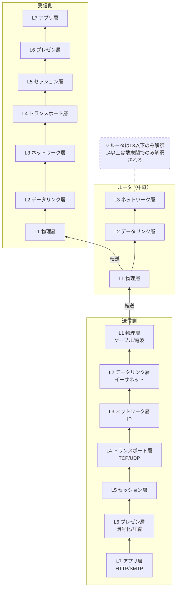

# OSI参照モデル

## 概要
コンピュータネットワークに求められる機能を7つの階層で整理したフレームワーク。

## 理解したこと

| 層 | 名前 | 役割 |
|---|---|---|
| L7 | アプリケーション層 | 具体的な通信サービスを実現（HTTP・SMTP等） |
| L6 | プレゼンテーション層 | データの表示形式を相互変換（圧縮・暗号化等） |
| L5 | セッション層 | 通信の開始から終了までの手順を管理 |
| L4 | トランスポート層 | 信頼性の向上など用途に応じた特性を実現（TCP・UDP） |
| L3 | ネットワーク層 | 中継により任意の機器同士の通信を実現（IP・ルーティング） |
| L2 | データリンク層 | 直接接続された機器同士の通信を実現（イーサネット） |
| L1 | 物理層 | コネクタ形状・ピン数など物理的な接続を規定 |

- 上位層は下位層の機能を利用して実現する（バケツリレー）
- L2はL1を利用、L3はL2を利用…という積み重ね
- L3以下はルータが中継に使う層。L4以上は端末間でのみ解釈される

**データの流れ（Zoomの例）**
- 送信側：L7→L1の順に「包んで」送り出す
- 中継（ルータ）：L1〜L3だけ見て転送
- 受信側：L1→L7の順に「開けて」処理する

## 構成図

<!-- イラスト図解式ネットワークの基本 1章 / 2026-03-30 -->

## 関連概念
- layered_architecture.md
- communication_protocol.md
- internetworking.md

## ソース
- 2026-03-28・「イラスト図解式 ネットワークの基本」第1章

## タグ
ネットワーク, OSI, プロトコル, レイヤー, インフラ
