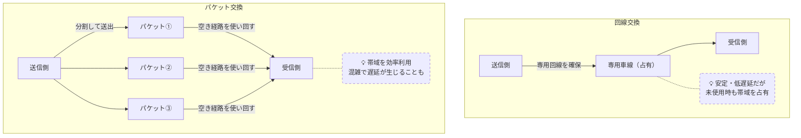

# パケットと通信交換方式

## 概要
データを小分けにして送るパケット交換と、専用回線を確保する回線交換の2つの通信方式。

## 理解したこと

**パケットの構造**
- **ヘッダ**：宛先などの制御情報（宛名ラベル）
- **ペイロード**：小分けにした実際のデータ（荷物の中身）

| | 回線交換 | パケット交換 |
|---|---|---|
| 仕組み | 通信前に専用回線を確保（予約制） | 空いている経路に小分けして投げる |
| 帯域 | 専用車線を占有。使わない時間も無駄になる | 全員で車線を使い回す。空きが生まれない |
| 速度・コスト | 遅い・高い | 速い・安い |
| 品質 | 安定・遅延なし | 混雑で遅延が生じることがある |
| リアルタイム性 | 高い | 工夫が必要（UDPなど） |

**帯域のイメージ**
- 帯域 = 道路の車線数
- 回線交換：1車線を専有予約
- パケット交換：全員で空き車線を使い回す

## 構成図

<!-- イラスト図解式ネットワークの基本 1章 / 2026-03-30 -->

## 関連概念
- communication_protocol.md
- osi_model.md
- client_server_vs_p2p.md

## ソース
- 2026-03-28・「イラスト図解式 ネットワークの基本」第1章

## タグ
ネットワーク, パケット, 回線交換, パケット交換, 帯域, インフラ
