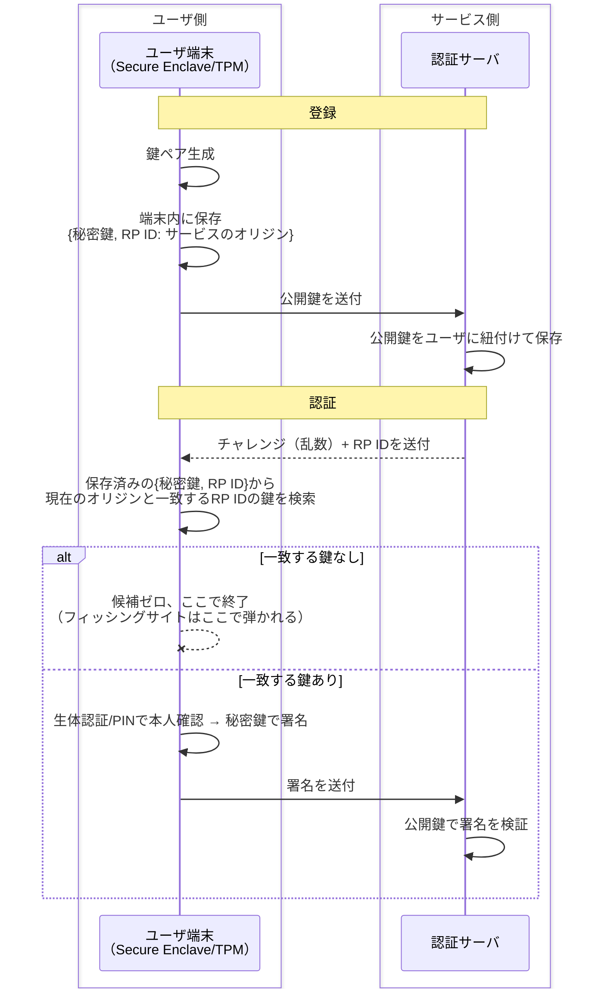

# パスキー認証

## 概要
秘密鍵を端末内に閉じ込めたまま、チャレンジ・レスポンス方式でオリジン（ドメイン）ごとに本人を証明する認証方式。

WebAuthn（FIDO2）という標準規格で定義されている。

## 理解したこと

### 登録・認証のフロー

---

### なりすまし・フィッシング対策の仕組み

パスワードと違い、サーバ側に見えるのは「正しい公開鍵で検証できた署名」だけ。

守っている対象ごとに仕組みが分かれている。

| 対策 | 仕組み |
|--|--|
| フィッシング耐性 | 秘密鍵はオリジン（URL/RP ID）と紐付けて保存されるため、偽サイトではそもそも鍵が候補に出ない |
| 端末窃取対策 | 秘密鍵の使用に生体認証/PINが必須。Secure Enclave内で本人確認が通って初めて署名される |
| 盗聴耐性 | チャレンジ・レスポンス方式のため、秘密情報自体はネットワークに流れない（チャレンジ・レスポンス認証と同じ仕組み） |

---

### SSH鍵認証との違い

同じ「公開鍵・秘密鍵＋チャレンジ・レスポンス」の仕組みでも、パスキーはオリジン紐付けと同期を前提にしている分、SSH鍵とは思想が異なる。

| | SSH鍵認証 | パスキー |
|--|--|--|
| 秘密鍵の保存場所 | 端末のみ、外に出ない | 端末のSecure Enclave。クラウド経由で他端末に複製可能 |
| オリジン紐付け | なし | あり（RP ID単位で鍵候補が自動的に絞られる） |
| 署名時のローカル認証 | パスフレーズ（任意） | 生体認証/PIN（前提） |

---

## 関連概念
- [challenge_response_auth.md](challenge_response_auth.md)（署名がなぜ安全かの土台となる仕組み）
- [ssh_key_auth.md](ssh_key_auth.md)（同じ公開鍵・秘密鍵の考え方を使う認証方式。オリジン紐付けと同期がパスキー固有の差分）

## ソース
- 2026-08-24・イラスト図解式セキュリティの基本 第2章

## タグ
認証, セキュリティ, 公開鍵暗号, WebAuthn, FIDO2, パスキー, チャレンジレスポンス, フィッシング対策
