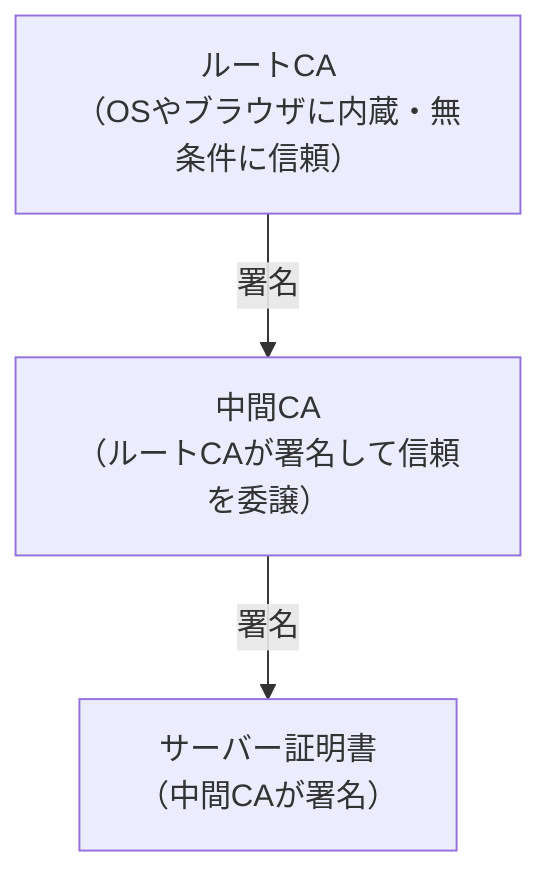

# PKI（Public Key Infrastructure）

## 概要
公開鍵暗号を使った「信頼の体系」全体を指す考え方。特定のプロトコルや製品ではなく、仕組みの名前。

## 理解したこと

### 電子証明書の中身
| 項目 | 内容 |
|------|------|
| サブジェクト | 証明書の持ち主（例：google.com） |
| 公開鍵 | 持ち主の公開鍵 |
| 発行者 | 署名したCA名 |
| 有効期限 | 証明書の期限 |
| CAのデジタル署名 | ↑の内容が本物だとCAが保証したもの |

証明書の内容は**暗号化されておらず誰でも読める**。CAがデジタル署名することで「この公開鍵は本物」と保証する仕組みであり、隠すのではなく証明するのが目的。

### なぜPKIが必要か
公開鍵暗号では「その公開鍵が本物かどうか」を確認できない。誰でも偽の公開鍵を配れてしまうため、信頼できる第三者（CA）による保証が必要になる。

### 構成要素

| 要素 | 具体例 |
|------|--------|
| 公開鍵暗号 | RSA、ECDSAなど |
| 証明書の形式 | X.509（標準フォーマット） |
| 認証局（CA） | Let's Encrypt、DigiCert、VeriSignなど |
| 証明書を使うプロトコル | TLS/SSL、S/MIMEなど |

### 階層構造（信頼チェーン）

- ルートCAは数が少なく厳重に管理される
- 中間CAを挟むことでルートCAを守る（ルートCAが直接署名しない）
- ブラウザはルートCAから順に署名を辿って証明書を検証する

### HTTPSにおけるPKIの役割
1. サーバーがCA署名済みの証明書（公開鍵入り）をブラウザに送る
2. ブラウザが証明書の署名を検証し「本物のサーバーだ」と確認する
3. その公開鍵を使って共通鍵を安全に交換し、通信を暗号化する

### PKIとユーザー認証の違い
どちらも「信頼できる第三者が身元を保証する」構造だが、保証する対象が違う。

| | PKI | ユーザー認証（OAuth） |
|---|---|---|
| 誰を証明？ | サーバー | ユーザー |
| 誰が証明？ | CA | Google・LINEなど |
| 方向 | サーバー → ブラウザ | ユーザー → サービス |

HTTPSでは①PKIでサーバーを認証してから、②ユーザー認証が行われる。

## 関連概念
- ssl_tls.md
- oauth2.md
- https.md

## ソース
- 2026-05-11・会話での補足学習（イラスト図解式 ネットワークの基礎 第5章をきっかけに）

## タグ
PKI, 公開鍵暗号, CA, 認証局, 証明書, X.509, 信頼チェーン, セキュリティ, HTTPS
