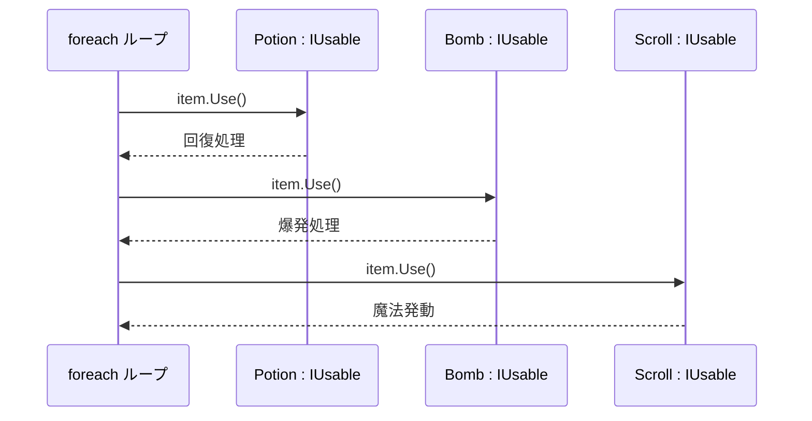
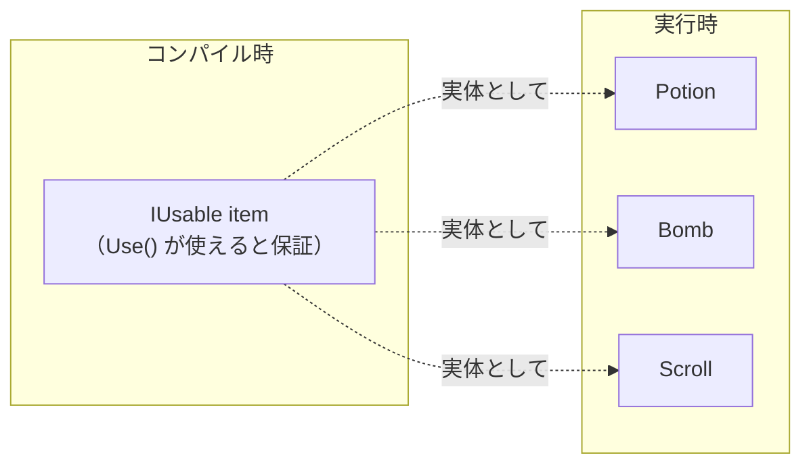

# ポリモーフィズム（Polymorphism / 多態性）

## 概要
同じ命令（メソッド呼び出し）を送っても、受け手の実体によって振る舞いが自動的に変わる性質。
語源：ギリシャ語「多くの（poly）」＋「形態（morphic）」

## 実現方法

| | インターフェース経由 | 抽象クラス経由 | 通常継承（virtual）経由 |
|---|---|---|---|
| override | 強制 | 強制 | 任意 |
| ポリモーフィズムの保証 | される | される | されない（しなくても動く） |
| 関係性 | Can-do（横） | Is-a（縦） | Is-a（縦） |
| 例 | `Potion` も `Bomb` も `Use()` | `Hero` / `Monster` が `Attack()` を必ず実装 | `Hero` が `Character.Attack()` を上書き |

## ポリモーフィズムなし vs あり

**なし（型を毎回チェックする必要がある）**
```csharp
foreach (var item in items) {
    if (item is Potion p) p.Use();
    else if (item is Bomb b) b.Use();
    else if (item is Scroll s) s.Use();  // 種類が増えるたびに追加が必要
}
```

**あり（呼び出し側は型を知らなくていい）**
```csharp
foreach (IUsable item in items) {
    item.Use();  // 実体が何であれ、正しい Use() が呼ばれる
}
```

## 呼び出しの流れ



## コンパイル時 vs 実行時の型



`List<IUsable>` と宣言することで「Use() が使える」とコンパイル時に保証し、実行時には中身が何であれ正しいメソッドが呼ばれる。

## 関連概念
- oop_interface
- inheritance
- oop_encapsulation

## ソース
- 2026-05-17：会話ベースの整理（C# .NET を題材に）

## タグ
ポリモーフィズム, OOP, C#, 多態性, virtual, override, interface, 型
