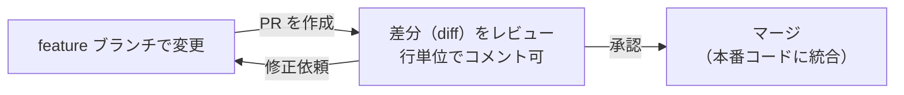

# Pull Request

## 概要
コードの変更をチームに確認・承認してもらうための申請の仕組み。

## 理解したこと

### PR の役割と流れ

自分のブランチでの変更を「本番コードに取り込んでいい？」と申請するもの。

---

### AI コードレビューとの関係

AI コードレビューはこの PR への自動コメント投稿として実装されることが多い。

---

## 関連概念
- git（PR の基盤となるコミット・ブランチ構造）
- git_branch（feature ブランチからの申請がPRの出発点）
- ai_subagent（AI コードレビューの実装先）

## ソース
- 2026-03-05・https://zenn.dev/mgdx_blog/articles/8f7994ad84151d

## タグ
Git, GitHub, コードレビュー, 開発フロー
