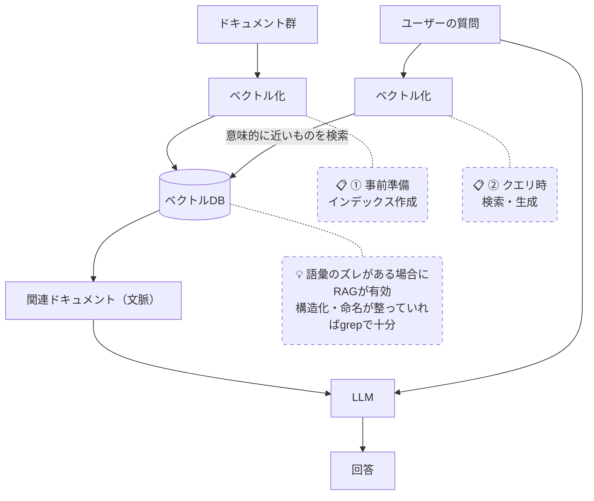

# RAG（検索拡張生成）

## 概要
LLMが回答を生成する前に外部ドキュメントをベクトルDBで検索し、関連情報を文脈に加える仕組み。

## 理解したこと
- ドキュメントを事前にベクトル（数値）に変換してDBに保存する（インデックス作成）
- 検索時は質問もベクトル化して、意味的に近いドキュメントを引っ張ってくる
- 同期ずれ問題：新しいファイルを作ってもインデックスが更新されるまでヒットしない
  → LLMの学習データの古さとは別の話。索引の更新が追いついていない問題
- LLMが賢くなる前の補助輪的な存在だった。曖昧な入力をベクトルで吸収する必要があった

### RAGが必要な条件 vs grep で十分な条件

- **RAGが要る**：ユーザーの言葉とドキュメントの言葉が一致しない「語彙のズレ」がある場合
  → 例）「有給の手続き」→ 文書は「年次有給休暇取得申請フロー」
  → 不特定多数・非エンジニアが使う社内検索に多い
- **grep で十分**：データ構造・命名が整っており、検索者が何を探すか知っている場合
  → Claude Code のコードベース検索、knowledge/ の概念検索など
  → 構造化・命名・検索者の知識レベルが揃っていれば RAG は不要

### 限界
- クエリが「最初の1回」で固定される → 意図とのズレを自己修正できない
- → この限界を超えるのが Agentic Search（反復RAGループ）

## 構成図

<!-- 2026-03-30 -->

## 関連概念
- agentic_search

## ソース
- 2026-03-11・https://zenn.dev/acntechjp/articles/c1296f425baf03
- 2026-03-16・https://zenn.dev/edash_tech_blog/articles/02582c4f70d0fb

## タグ
AI, 検索, ベクトルDB, LLM, インデックス
