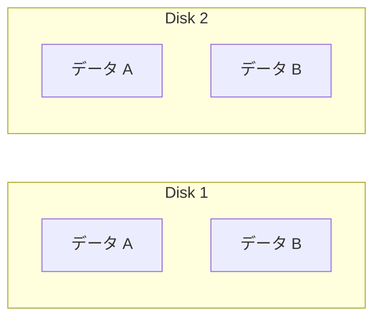
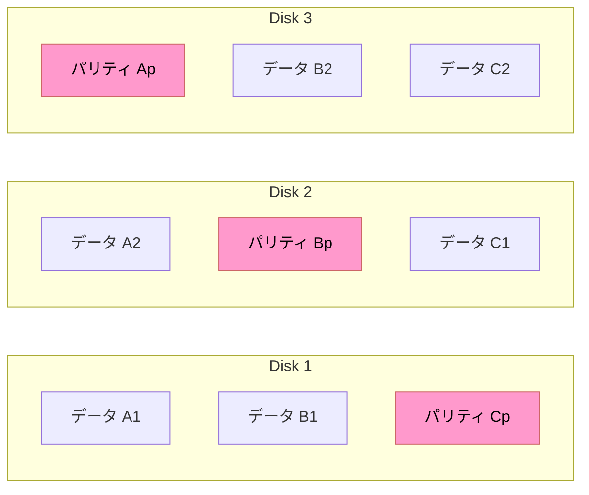
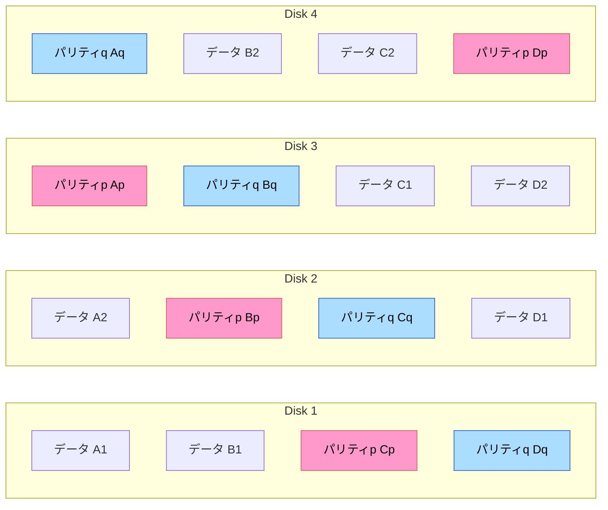
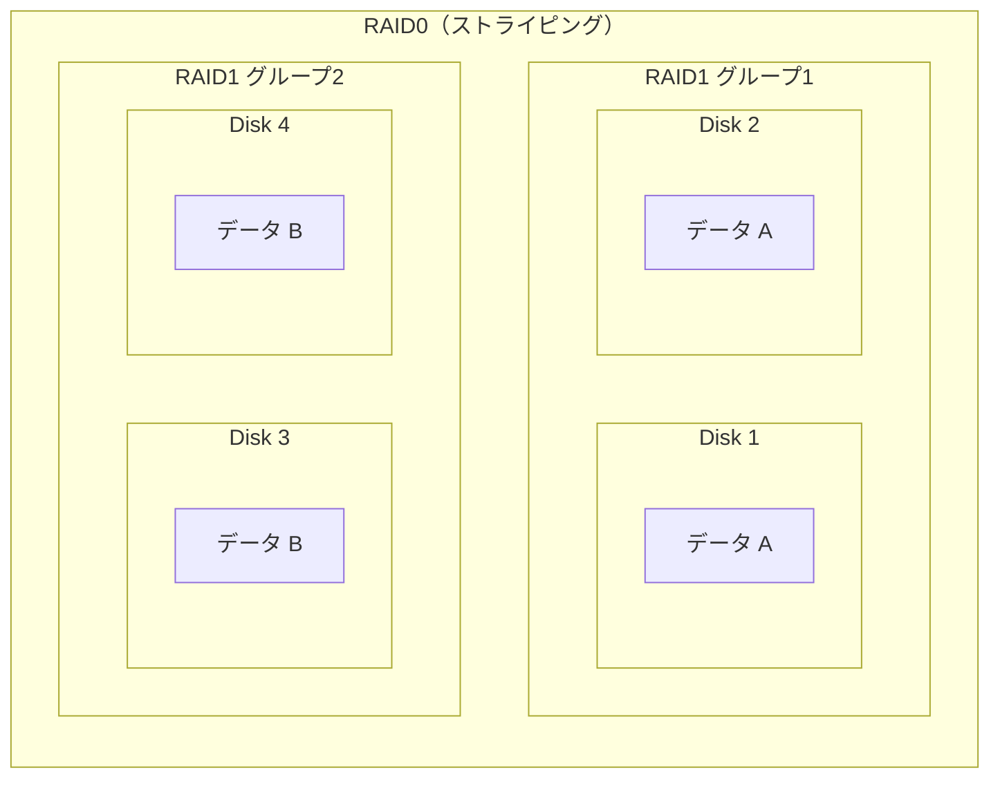

# RAID

## 概要
複数のディスク（HDD/SSD）を束ねて仮想的な1つのストレージとして扱う技術。安全性（冗長性）と性能向上の2つの目的を持つ。

## 理解したこと

### ディスクとは

補助記憶装置（HDD・SSD）のこと。主記憶装置（RAM）とは別物。

| | 主記憶装置 | 補助記憶装置 |
|---|---|---|
| 別名 | メモリ、RAM | ストレージ、ディスク |
| 役割 | CPUが直接読み書きする作業台 | データの永続保存 |
| 例 | DRAM（DDR4など） | HDD、SSD |
| 電源を切ると | 消える | 残る |

SSDの内部素子はNANDフラッシュメモリだが、役割としては補助記憶装置（ストレージ）。「SSDはメモリ」とは言わない。

---

### RAIDレベル比較

| RAID | 名称 | 最低本数 | 冗長性 | 特徴 |
|---|---|---|---|---|
| RAID0 | ストライピング | 2本 | なし | 分割のみ。本番DB論外 |
| RAID1 | ミラーリング | 2本 | 1本故障まで | 容量効率50%。信頼性は強固だが性能向上は限定的 |
| RAID5 | パリティ分散 | 3本 | 1本故障まで | パリティは常に1本分固定。ディスク増加でコスパ向上 |
| RAID6 | パリティ2重 | 4本 | 2本故障まで | RAID5のパリティ+1本分 |
| RAID10 | RAID1+0 | 4本 | RAID1と同等 | 信頼性と速度の両立。コスト高 |

---

### 各レベルの詳細

#### RAID0（ストライピング）

データを複数ディスクに分割して並列読み書き。冗長性ゼロ。1本壊れると全データ消失。本番DBでは絶対に使わない。

#### RAID1（ミラーリング）

2本に同一データを同時書き込み。両方常時使用。容量は2本で1本分。

#### RAID5（パリティ分散）

データとパリティを全ディスクに分散格納。パリティ単体では復元不可。「残りのデータ＋パリティ」を組み合わせて計算することで壊れた1本分を復元する。

パリティは常に1本分固定。ディスクを増やすほどデータ領域の比率が上がり、性能とコスパが向上する。

#### RAID6

RAID5のパリティを2本分（p・q）に増やした構成。2本同時故障でも復元可能。

#### RAID10（RAID1+0）

RAID1グループを複数作り、そのグループ間でRAID0（ストライピング）を構成する二段構え。高信頼性と高速性を両立するがコストが高い。

---

### DBでの選択指針

| 優先度 | 選択 | 理由 |
|---|---|---|
| 望ましい | RAID10 または RAID6 | 信頼性と性能の両立 |
| 最低限 | RAID5 | コストと安全性のバランス |
| 論外 | RAID0 | 冗長性ゼロ。本番DBに使ってはいけない |

---

## 関連概念
- db_design（ストレージの冗長構成決定は物理設計の5タスクの一つ）

## ソース
- 2026-06-04：達人DB 第2章

## タグ
RAID, ストレージ, 冗長性, 物理設計, ディスク, HDD, SSD, パリティ, ストライピング, ミラーリング
