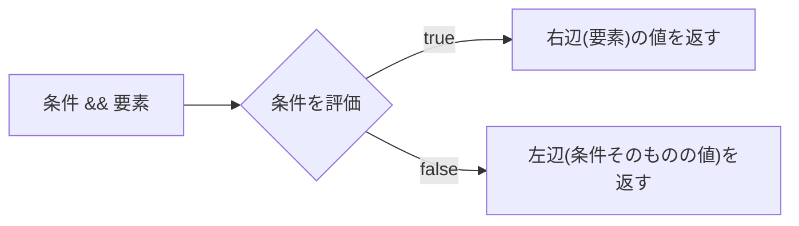

# React 条件付きレンダリング

## 概要
JSXの中で条件に応じて表示する要素を切り替える手法。三項演算子と`&&`演算子の2パターンが基本。

## 理解したこと

### 三項演算子: どちらか片方を必ず表示する
`条件 ? A : B`。elseがある「どちらかを必ず出す」場面に使う。

```jsx
{isLoggedIn ? "ログアウト" : "ログイン"}する
```

---

### `&&`: 条件を満たす時だけ表示する（式としての評価）
`条件 && 要素`は「trueなら実行する」という手続き的なものではなく**式の評価**。条件がtrueなら右辺（要素側）の評価結果を返し、falseなら左辺（条件の値そのもの）を返すだけ。



falseの場合に返るのは`false`自体。Reactは`false`/`null`/`undefined`を「何も描画しない」特別値として扱うため、結果的に非表示に見える。

---

### 落とし穴: 条件式に数値をそのまま使うと`0`が画面に出る
`false`/`null`/`undefined`の特別扱いの対象に`0`や`""`は含まれない。条件部分に数値をそのまま置くと、値が`0`の時、falsyであってもReactにとっては「表示すべき値である`0`」がそのまま画面に出てしまう。

| 書き方 | count=0の時の挙動 |
|---|---|
| `count && <span>件あります</span>` | 画面に`0`が表示される（❌） |
| `count > 0 && <span>件あります</span>` | 何も表示されない（✅） |

対策は比較演算子で明示的にboolean化してから`&&`に渡すこと。

## 関連概念
- react_key（一覧の条件付き表示と組み合わせる場面が多い）

## 関連実装
- [react_conditional_children](../coding/react_conditional_children/) — `&&`の落とし穴（0の表示）を実際に再現して確認した

## ソース
- 2026-08-11・/codeセッションでの実装・対話から整理

## タグ
React, JSX, 条件付きレンダリング, 短絡評価
