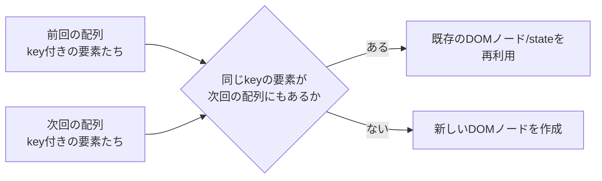

# React key

## 概要
Reactがリストの要素をレンダリング間で追跡するための目印。同じkeyなら「同じ要素」とみなし、既存のDOMノードとそのstateを再利用する。

## 理解したこと

### keyはReactが「前回と同じ要素か」を判定するための目印
`.map`で配列をレンダリングするとき、Reactは新しい配列と前回の配列を比較する際にkeyを頼りに要素を対応づける。



---

### indexをkeyにすると、配列の中身が変わってもindex自体はずれない
`{items.map((item, index) => <div key={index}>...)}`のようにindexをkeyにすると、配列の先頭を削除しても各行のindexは0,1,2...のまま変わらない。Reactは「中身がずれた」ことに気づけず、古いDOMノードをそのまま次の要素に使い回してしまう。

```jsx
{items.map((item, index) => (
  // ❌ indexをkeyにすると、削除・並び替えで中身とDOMの対応がズレる
  <div key={index}>
    {item.label}: <input placeholder="何か入力" />
  </div>
))}
```

実際に試すと、各行のinputに文字を入力してから先頭要素を削除した場合、indexキーだと入力した文字が別のlabelの行についていってしまう。削除前後でindexと要素の対応がどうズレるかを見るとわかりやすい。

| | index=0 | index=1 | index=2 |
|---|---|---|---|
| 削除前の要素 | A | B | C |
| 削除後の要素 | B | C | （消滅） |

削除後もindex=0のkeyを持つのは要素"B"だが、Reactは「前回index=0だったDOMノード（"A"の行、inputの入力内容込み）」をそのまま使い回してしまう。中身は"A"から"B"に変わったのに、DOMノードとその中のinputの状態は"A"の時のまま引き継がれる、というのがズレの正体。

---

### 対策はデータ自体が持つ安定した一意な値をkeyにすること
`item.id`のような、要素ごとに変わらない一意な値をkeyにすれば、要素が削除・並び替えされてもReactは正しく「どれがどれか」を追跡できる。

| keyの選び方 | 削除・並び替えへの耐性 |
|---|---|
| index | ✗ 対応がズレる |
| データ固有のid | ✓ 正しく追跡できる |

## 関連概念
- react_use_ref（keyのズレで表面化する「Reactが前回と同一の要素/DOMノードだと判定して使い回す」という仕組みの土台が共通）
- react_rendering（keyが使われる差分比較(reconciliation)自体の一般的な仕組み）

## 関連実装
- [react_todo_app](../coding/react_todo_app/) — KeyPitfallDemoでindexキーとidキーの挙動差を確認した

## ソース
- 2026-08-10・/codeセッションでの実装から整理

## タグ
React, key, リストレンダリング, reconciliation, 差分検出
