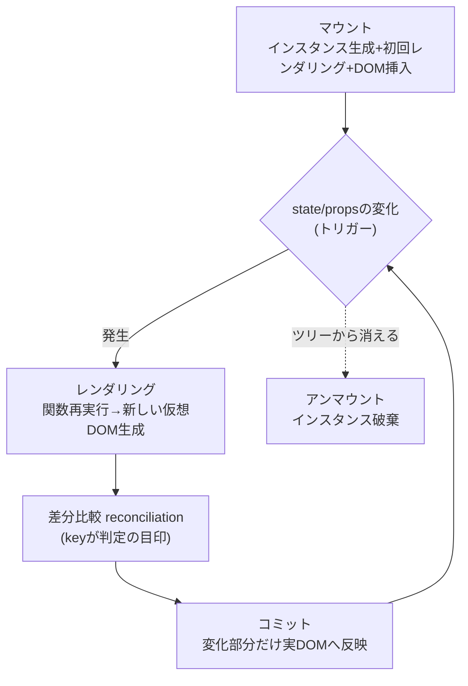
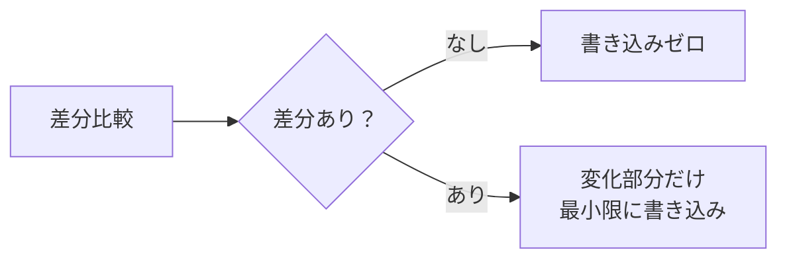

# React レンダリングの仕組み

## 概要
Reactの「レンダリング」は実DOMの描画ではなく、仮想DOMを作る工程。差分比較（reconciliation）を経て、変化した部分だけが実DOMに反映される。

## 理解したこと

### マウント〜アンマウントの全体像
マウントは「インスタンス生成＋初回レンダリング＋DOM挿入」をまとめた工程。以降はトリガーが起きた時だけ輪が回る。

---

### 差分の有無が実DOMへの書き込み量を決める

Virtual DOMなしの愚直な再描画なら、差分の有無に関わらず毎回まるごと書き換わる。「差分がある時だけ・最小限に」がVirtual DOMを挟む狙い。

## 関連概念
- react_key（reconciliationがkeyを頼りに前回と同じ要素かどうかを判定する）
- react_use_ref（マウント/アンマウントのタイミングでのみ値がリセットされ、再レンダリングでは保持される、という性質の土台が共通）
- react_use_effect（依存配列によるマウント/更新の判定が、トリガー駆動のレンダリングとどう繋がるか）
- dom（実DOM・DOM APIそのものの理解。仮想DOMとの対比元）

## 関連実装
- [react_todo_app](../coding/react_todo_app/) — RefVsStateDemoで「再レンダリングでは値がリセットされない」ことを確認した

## ソース
- 2026-08-15・/codeセッション（react_dotnet_api）の対話から整理

## タグ
React, レンダリング, 仮想DOM, Virtual DOM, reconciliation, マウント, アンマウント, コミット
