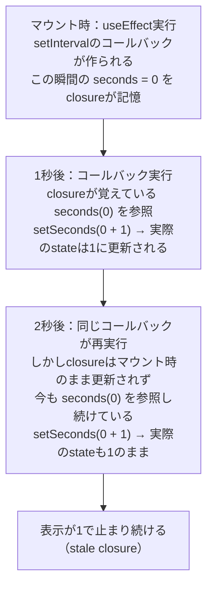

# React useEffect

## 概要
レンダリング後に実行される副作用処理を管理するフック。第2引数の依存配列で「いつ実行するか」を制御する。

## 理解したこと

### 構文の骨格
useEffectは第1引数に関数（副作用そのもの）、第2引数に依存配列を取る。第1引数の関数は、任意でクリーンアップ用の関数をreturnできる。

第1引数の関数自体も、`setInterval`に渡す関数と同じく**コールバック**（後で呼び出してもらうために渡しておく関数）の一種。「今すぐ実行する」のではなく「実行してほしいタイミングが来たら呼んでね」と関数そのものを渡している。

```js
useEffect(() => {
  // ① ここに副作用の処理を書く
  return () => {
    // ② ここに後片付け(クリーンアップ)を書く(省略可)
  };
}, []); // ③ 依存配列
```

| 部分 | 何か |
|---|---|
| ① 第1引数の関数の中身 | レンダリング後に実行される副作用そのもの |
| ② ①がreturnする関数 | クリーンアップ処理。省略可能で、書かなければ何も後片付けされない |
| ③ 第2引数の配列 | ①をいつ再実行するかを決める依存配列 |

---

### 依存配列の3パターン
useEffect自体は毎レンダリング呼ばれているが、中身を実際に走らせるかどうかを依存配列で判断している（マウント/レンダリング/アンマウントの定義はreact_rendering参照）。

| 依存配列 | 実行タイミング |
|---|---|
| なし | 毎回のレンダリング後 |
| `[]` | 初回マウント時の1回だけ |
| `[value]` | 初回、および`value`が前回のレンダリングと変わった時 |

---

### クリーンアップ関数
useEffectがreturnする関数はクリーンアップ処理で、コンポーネントのアンマウント時、または次にeffectが再実行される直前に呼ばれる。

```js
useEffect(() => {
  const timerId = setInterval(() => {
    setSeconds((prev) => prev + 1);
  }, 1000);

  return () => clearInterval(timerId); // クリーンアップ
}, []);
```

解除し忘れると、コンポーネントが消えた後もタイマーが動き続け、メモリリークや意図しない更新の原因になる。

---

### 依存配列`[]`の落とし穴：クロージャの古い値
`[]`だと1回しか実行されないため、内部で作られるコールバック（`setInterval`の中身など）はマウント時の値を覚えたまま使われ続ける（クロージャの仕組み自体はclosure参照）。



対策は関数型の更新（`setState((prev) => ...)`）。Reactが実行時点の最新値を渡してくれるため、クロージャが古い値を覚えていても影響を受けない（詳細はreact_use_state参照）。

## 関連概念
- closure（stale closureが起きる根本メカニズム）
- react_use_state（対策となる関数型の更新パターン）
- react_use_ref（マウント・アンマウントという同じライフサイクル用語を、値が保持/破棄されるタイミングの説明に使っている）
- react_rendering（マウント・レンダリング・アンマウントの定義、依存配列の判定がトリガー駆動のレンダリングとどう繋がるか）

## 関連実装
- [react_basics](../coding/react_basics/) — ElapsedTimerでsetIntervalのクリーンアップ、documentのtitle更新で依存配列`[count]`の挙動を確認した

## ソース
- 2026-08-02・/codeセッションでの実装・対話から整理

## タグ
React, Hooks, useEffect, 副作用, 依存配列, クリーンアップ, stale closure
