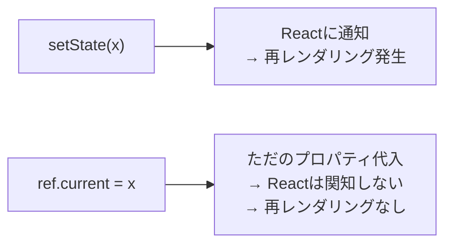

# React useRef

## 概要
再レンダリングを起こさずに、レンダリングをまたいで値を保持できるフック。DOM要素への直接アクセスにも使われる。

## 理解したこと

### 実体は`{ current: 初期値 }`という1プロパティだけのオブジェクト
`.current`というキー名は固定。自由に名付けられるのは受け取る変数側（`inputRef`など）だけ。

```js
const inputRef = useRef(null); // { current: null }
inputRef.current.focus();
```

| | useState | useRef |
|---|---|---|
| 返り値 | `[値, 更新関数]`の配列 | `{ current: 値 }`のオブジェクト |
| 名前の自由度 | 配列の分割代入なので変数名は自由 | オブジェクトなので`.current`固定。自由なのは受け取る変数名だけ |

---

### 違いは「保持できるか」ではなく「再レンダリングを起こすか」
どちらも値はレンダリングをまたいで保持される。違うのは更新時にReactへ再描画を要求するかどうかだけ。



---

### 値が保持される理由：関数は再実行されるが、インスタンスは生き続ける
コンポーネント関数自体は再レンダリングのたびに最初から呼び直されるため、普通の`let`はリセットされる。hookの値はインスタンス側に保存されているため生き残る。

```jsx
function Component() {
  let normalVariable = 0;      // 毎回0に戻る（関数が再実行されるため）
  const [state] = useState(0); // 生き残る（インスタンス側）
  const ref = useRef(0);       // 生き残る（インスタンス側）
}
```

値がリセットされるのはマウント/アンマウントの瞬間だけ（詳細はreact_rendering参照）。

---

### 2つの用途

| 用途 | 使い方 | 理由 |
|---|---|---|
| DOM要素への直接アクセス | `<input ref={inputRef} />` → `inputRef.current.focus()` | `.focus()`などブラウザのDOM APIをReactの外側から直接呼びたい |
| 画面に出さない値の保持 | `const nextId = useRef(0); nextId.current += 1;` | useStateだと更新のたびに不要な再レンダリングが起きてしまう |

## 関連概念
- react_use_state（配列の分割代入で自由に命名できる点との対比／両者とも値はインスタンス側で保持される点）
- react_use_effect（マウント・更新・アンマウントというコンポーネントのライフサイクル用語）
- react_key（「前回と同一の要素/DOMノードだと判定して使い回す」という同じ仕組みが、リストの要素単位で表面化したものがkey）
- react_rendering（マウント・レンダリング・アンマウントの粒度の違い、仮想DOMとの関係の詳細）

## 関連実装
- [react_todo_app](../coding/react_todo_app/) — 入力欄へのフォーカス（DOM参照）と、refの変更が再レンダリングを起こさないことを確認するデモで実装した

## ソース
- 2026-08-10・/codeセッションでの実装・対話から整理

## タグ
React, Hooks, useRef, DOM操作, 再レンダリング, コンポーネントのインスタンス
