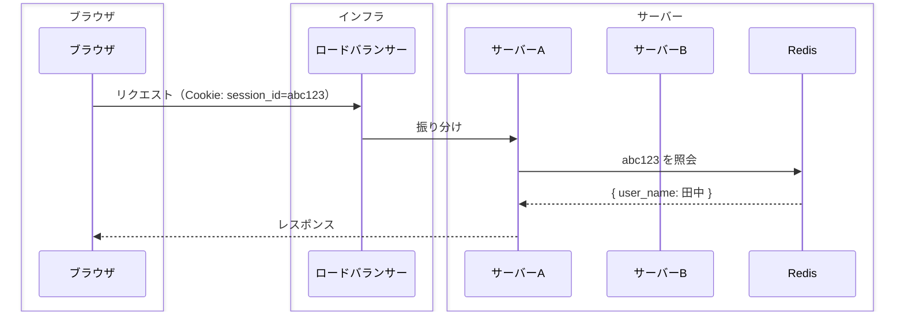

# Redis

## 概要
RAM上にデータを置くKey-Valueストア。ディスクではなくメモリに保存するため高速で、複数サーバーからネットワーク越しにアクセスできる共有ストアとして使う。

## 理解したこと

### インメモリとは
メモリ = RAM のこと。コンピュータのデータの置き場所は2種類ある：

| | RAM（メモリ） | ストレージ（ディスク） |
|---|---|---|
| 速さ | 超高速 | 低速 |
| 電源を切ると | 消える | 残る |
| 容量 | 小さい | 大きい |

Redis は「DBだけどRAMに置く」設計で、普通のDBより圧倒的に速い。

---

### セッションストアとしての使われ方
ロードバランサー環境では各サーバーが個別にセッションを持つとズレが生じる。

Redisを独立したサーバーとして立て、全サーバーがネットワーク越しに共通のセッションストアへアクセスする：



データ構造はセッションIDがキー、セッションデータが値のKey-Value：

```
"abc123" → { "login": "ok", "user_name": "田中" }
```

---

### 動かす場所
物理かクラウドかは問わない。本質は「アプリサーバーとは別のプロセスとして動いていて、ネットワーク越しにアクセスできる」こと：

| 形態 | 例 |
|---|---|
| 物理サーバー（オンプレ） | 自社のサーバールームにRedis専用機を置く |
| クラウド（マネージドサービス） | AWS ElastiCache、Google Memorystore |
| クラウド内の別VM | EC2インスタンスの1つにRedisを入れる |

---

### SPOF問題と対策
Redisが1台しかない場合、そこが落ちると全サーバーがセッション情報を取得できなくなる → 全ユーザー強制ログアウト。これがSPOF（Single Point of Failure）：「そこが壊れたら全体が止まる1点」。

対策は3つ、全部「Redisが1台しかない状態をなくす」方向：

| 対策 | 考え方 |
|---|---|
| レプリケーション | メインが落ちたら控えに切り替える |
| Redis Cluster | 最初から複数台に分散して1台依存をなくす |
| マネージドサービス | クラウド側に冗長化を丸投げする |

---

## 関連概念
- session_management.md（セッションストアとして使う文脈で登場）
- load_balancer.md（複数サーバー環境でRedisが必要になる理由）

## ソース
- 壁打ちから整理（2026-06-06）

## タグ
Redis, インメモリ, Key-Value, セッションストア, SPOF, 冗長化
