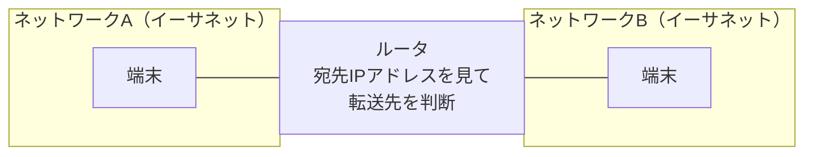

# ルータ

## 概要
ネットワーク層（L3）でIPパケットを転送する機器。独立したネットワーク間に入ってパケットを中継する。

## 理解したこと

### 全体像

ルータが間に入ることで、個別ネットワークの独立性を損なわずに相互通信が可能になる。転送先の判断基準は宛先IPアドレス（L3で扱うIPパケットを見る）。

---

## 関連概念
- [internet_layer](internet_layer.md)（ルータが動作するTCP/IPの層）
- [ip_address](ip_address.md)（転送判断に使う宛先アドレス）
- [packet_and_switching](packet_and_switching.md)（ルータが転送するデータの単位）
- [hub_and_switch](hub_and_switch.md)（L1/L2で動く対になる機器）
- [routing](routing.md)（ルータが転送先を決めるための具体的な仕組み）
- [l3_switch](l3_switch.md)（同じL3転送の役割をLAN内特化で担う専用機器。ルータとの比較はこちらに集約）

## ソース
- 2026-04-09：イラスト図解式ネットワークの基本 第2章

## タグ
ルータ, L3, ネットワーク層, IPパケット, ルーティング, インフラ
