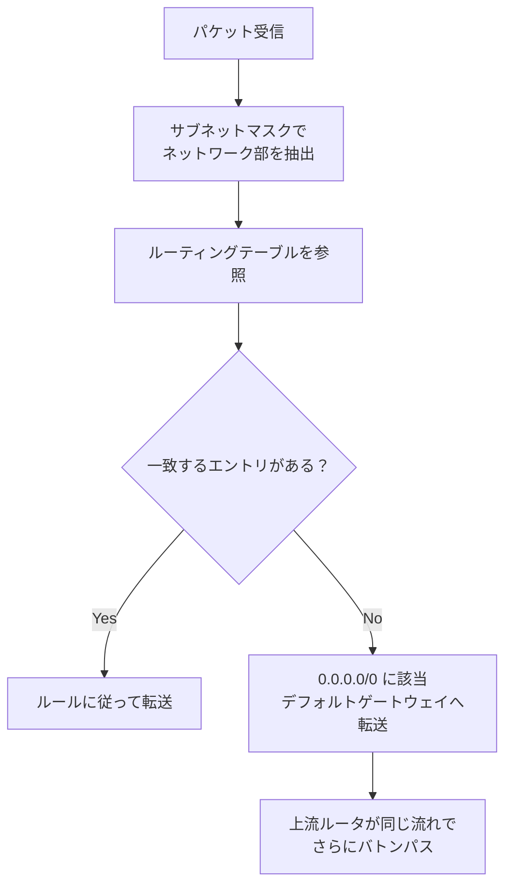
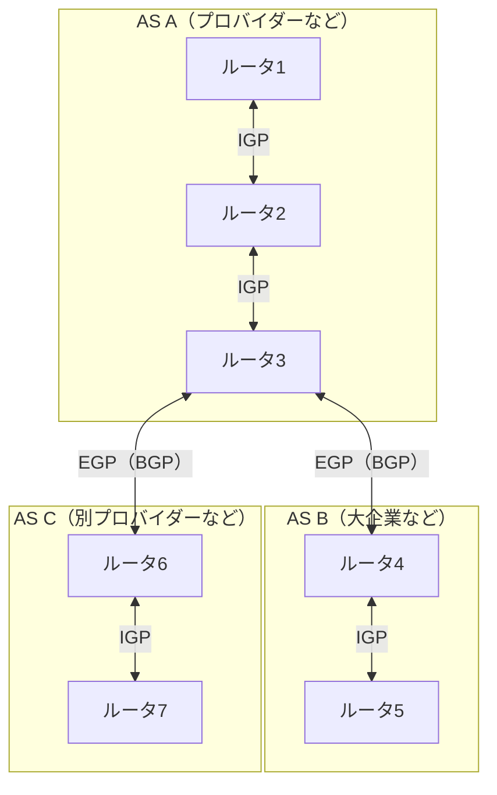

# ルーティング

## 概要
ルータがパケットをルーティングテーブルに基づいて宛先ネットワークへ転送する仕組み。

## 理解したこと

### ルーティングの流れ

### ルーティングテーブル
- 「宛先ネットワーク」と「そこへの転送先（次のルータ）」の対応表
- ルータは最も一致するエントリを選んで転送する（最長一致）

### デフォルトゲートウェイ
- ルーティングテーブルに一致する宛先がない場合のフォールバック転送先
- テーブル外の特別な仕組みではなく、`0.0.0.0/0`（すべてのIPにマッチ）というエントリとしてテーブル内に記載される
- どのエントリにもマッチしなかったとき、必ずこのエントリに該当する
- 利用シーン：インターネットへの接続、組織内の別ネットワークへの接続 → 共通点は「自分のネットワーク外に出るとき」

### デフォルトゲートウェイの負荷について
- 行き先不明なパケットを全部受け取るが、そのルータ自身も同様にルーティングテーブルでさらに上流へバトンパスする
- 「全部さばく賢いルーター」ではなく「とりあえず上の人に回す係」
- 最終的にはISPや主要バックボーンの大きなルーターが適切な宛先を把握している

### ルーティングテーブルの管理方式
ルーティングテーブルの管理方法は2種類ある。

- **スタティックルーティング**：管理者が手動でルーティングテーブルを設定・管理する
- **ダイナミックルーティング**：ルータ同士が適切なタイミングで情報を交換し、テーブルを自動更新する

### ルーティングプロトコル
ダイナミックルーティングで使うプロトコルの総称。2つの働きを持つ。

1. ルータ同士で経路情報を交換する
2. 集めた経路情報から最適な経路を選び出す

#### IGP と EGP

AS（Autonomous System）のスコープによって使うプロトコルが異なる。

| 種別 | スコープ | 代表プロトコル |
|------|---------|--------------|
| IGP（Interior Gateway Protocol） | AS内部 | RIP/RIP2、OSPF |
| EGP（Exterior Gateway Protocol） | AS間 | BGP |

#### 各プロトコルの比較

| プロトコル | 対象規模 | 経路選択基準 | 特徴 |
|-----------|---------|------------|------|
| RIP/RIP2 | 小規模 | ホップ数のみ ※ | 導入簡単・収束遅い・速度考慮なし |
| OSPF | 中規模 | コスト（速度など） | 設定複雑・収束速い |
| BGP | AS間 | ASパス等の多要素 | AS間の経路制御に特化 |

※ **ホップ数**：パケットが宛先に届くまでに通過するルータの数。1つのルータを経由するごとに1ホップとカウントする。

## 関連概念
- router
- subnet
- cidr
- internet_layer
- ip_address
- autonomous_system

## ソース
- 2026-04-13：イラスト図解式ネットワークの基本 第3章
- 2026-04-14：イラスト図解式ネットワークの基本 第3章
- 2026-04-16：イラスト図解式ネットワークの基本 第3章

## タグ
ルーティング, ルーティングテーブル, デフォルトゲートウェイ, 0.0.0.0/0, サブネットマスク, スタティックルーティング, ダイナミックルーティング, ルーティングプロトコル, IGP, EGP, RIP, OSPF, BGP, AS, インフラ, ネットワーク
