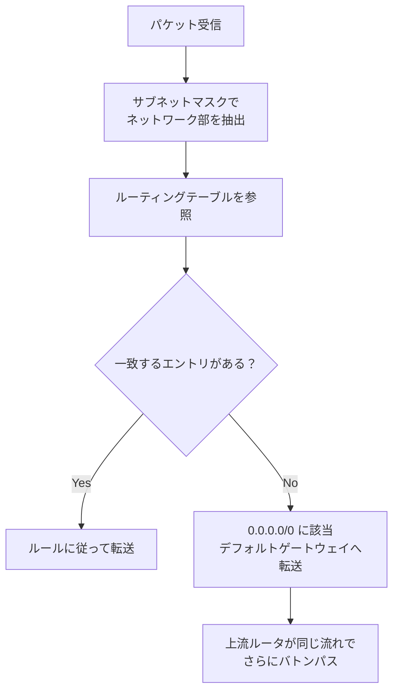
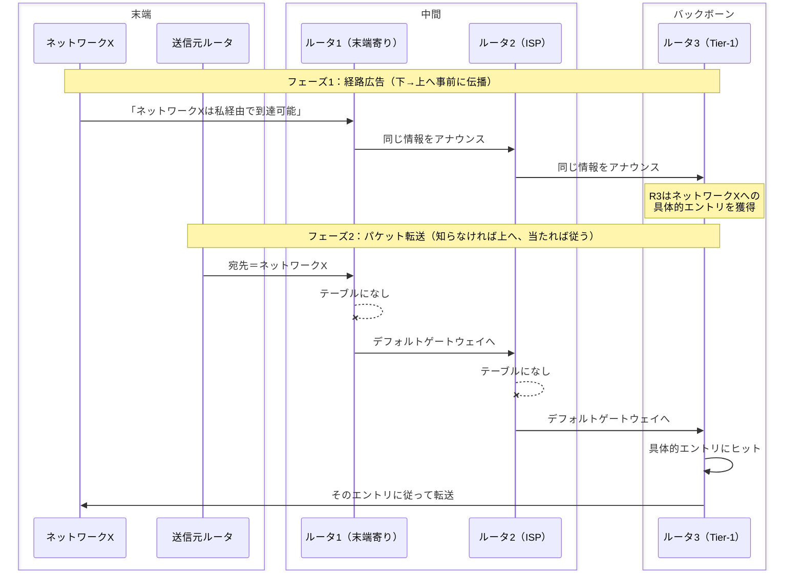

# ルーティング

## 概要
ルータがパケットをルーティングテーブルに基づいて宛先ネットワークへ転送する仕組み。

## 理解したこと

### 全体像

```mermaid
flowchart TD
    A[パケット受信] --> B[サブネットマスクで\nネットワーク部を抽出]
    B --> C[ルーティングテーブルを参照]
    C --> D{一致するエントリがある？}
    D -- Yes --> E[ルールに従って転送]
    D -- No --> F[0.0.0.0/0 に該当\nデフォルトゲートウェイへ転送]
    F --> G[上流ルータが同じ流れで\nさらにバトンパス]
```

---

### ルーティングテーブルとデフォルトゲートウェイ

- ルーティングテーブルは「宛先ネットワーク」と「そこへの転送先（次のルータ）」の対応表。ルータは最も一致するエントリを選んで転送する（最長一致）
- デフォルトゲートウェイは、テーブルに一致する宛先がない場合のフォールバック転送先。テーブル外の特別な仕組みではなく `0.0.0.0/0`（すべてのIPにマッチ）というエントリとしてテーブル内に記載される
- 利用シーンは「自分のネットワーク外に出るとき」全般（インターネットへの接続、組織内の別ネットワークへの接続）
- デフォルトゲートウェイ自身も行き先不明なパケットをさらに上流へバトンパスするだけで、「全部さばく賢いルータ」ではなく「とりあえず上の人に回す係」。最終的にはISPや主要バックボーンの大きなルータが適切な宛先を把握している

---

### なぜ最終的に辿り着けるのか（経路広告との関係）

末端のルータが「知らないから上流へ」を選べるのは、上流のどこかで必ず「知っている」状態が経路広告によって事前に保証されているから。パケットが流れる転送（フェーズ2）とは別に、経路情報を下から上へ伝播させる仕組み（フェーズ1）が先に存在している。

```mermaid
sequenceDiagram
    box 末端
    participant Net as ネットワークX
    participant Snd as 送信元ルータ
    end
    box 中間
    participant R1 as ルータ1（末端寄り）
    participant R2 as ルータ2（ISP）
    end
    box バックボーン
    participant R3 as ルータ3（Tier-1）
    end

    Note over Net,R3: フェーズ1：経路広告（下→上へ事前に伝播）
    Net->>R1: 「ネットワークXは私経由で到達可能」
    R1->>R2: 同じ情報をアナウンス
    R2->>R3: 同じ情報をアナウンス
    Note over R3: R3はネットワークXへの<br/>具体的エントリを獲得

    Note over Snd,R3: フェーズ2：パケット転送（知らなければ上へ、当たれば従う）
    Snd->>R1: 宛先＝ネットワークX
    R1--xR1: テーブルになし
    R1->>R2: デフォルトゲートウェイへ
    R2--xR2: テーブルになし
    R2->>R3: デフォルトゲートウェイへ
    R3->>R3: 具体的エントリにヒット
    R3->>Net: そのエントリに従って転送
```

インターネットのバックボーンを構成するTier-1 ISPクラスのルータは、実際にアナウンスされている行き先のほぼ全てを具体的なエントリとして持っており、デフォルトゲートウェイという逃げ道を使う必要がない（"default-free zone"と呼ばれる）。経路広告の具体的なプロトコルは[routing_protocols.md](routing_protocols.md)を参照。

---

### ルーティングテーブルの管理方式

| 方式 | 内容 |
|--|--|
| スタティックルーティング | 管理者が手動でルーティングテーブルを設定・管理する |
| ダイナミックルーティング | ルータ同士が適切なタイミングで情報を交換し、テーブルを自動更新する |

ダイナミックルーティングで使うプロトコル群の詳細は [routing_protocols.md](routing_protocols.md) を参照。

---

## 関連概念
- [router](router.md)（ルーティングを実行する機器）
- [subnet](subnet.md)（ネットワーク部抽出に使うサブネットマスクの単位）
- [cidr](cidr.md)（ルーティングテーブルの集約という本来の目的）
- [internet_layer](internet_layer.md)（ルーティングが行われるTCP/IPの層）
- [ip_address](ip_address.md)（転送判断の対象となるアドレス）
- [autonomous_system](autonomous_system.md)（ダイナミックルーティングのプロトコル選択を左右するスコープ単位）
- [routing_protocols](routing_protocols.md)（ダイナミックルーティングで使われるプロトコル群の詳細）

## ソース
- 2026-04-13：イラスト図解式ネットワークの基本 第3章
- 2026-04-14：イラスト図解式ネットワークの基本 第3章
- 2026-04-16：イラスト図解式ネットワークの基本 第3章

## タグ
ルーティング, ルーティングテーブル, デフォルトゲートウェイ, 0.0.0.0/0, サブネットマスク, スタティックルーティング, ダイナミックルーティング, インフラ, ネットワーク
