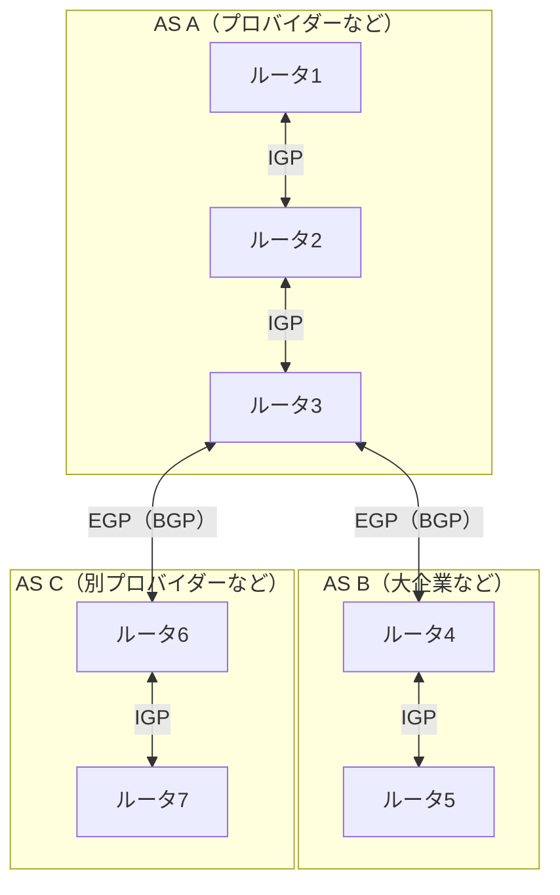

# ルーティングプロトコル

## 概要
ダイナミックルーティングでルータ同士が経路情報を交換し、最適な経路を選び出すためのプロトコル群。

## 理解したこと

### 全体像（IGPとEGP）

AS（Autonomous System）のスコープによって使うプロトコルが異なる。

| 種別 | スコープ | 代表プロトコル |
|------|---------|--------------|
| IGP（Interior Gateway Protocol） | AS内部 | RIP/RIP2、OSPF |
| EGP（Exterior Gateway Protocol） | AS間 | BGP |

---

### 各プロトコルの比較

| プロトコル | 対象規模 | 経路選択基準 | 特徴 |
|-----------|---------|------------|------|
| RIP/RIP2 | 小規模 | ホップ数のみ ※ | 導入簡単・収束遅い・速度考慮なし |
| OSPF | 中規模 | コスト（速度など） | 設定複雑・収束速い |
| BGP | AS間 | ASパス等の多要素 | AS間の経路制御に特化 |

※ **ホップ数**：パケットが宛先に届くまでに通過するルータの数。1つのルータを経由するごとに1ホップとカウントする。

---

## 関連概念
- [routing](routing.md)（ルーティングテーブルを動的に更新する仕組みとして使われる）
- [autonomous_system](autonomous_system.md)（IGP/EGPの境界となるスコープ単位）
- [router](router.md)（プロトコルを実行する機器）

## ソース
- 2026-04-13：イラスト図解式ネットワークの基本 第3章
- 2026-04-14：イラスト図解式ネットワークの基本 第3章
- 2026-04-16：イラスト図解式ネットワークの基本 第3章

## タグ
ルーティングプロトコル, IGP, EGP, RIP, OSPF, BGP, AS, ダイナミックルーティング, インフラ, ネットワーク
