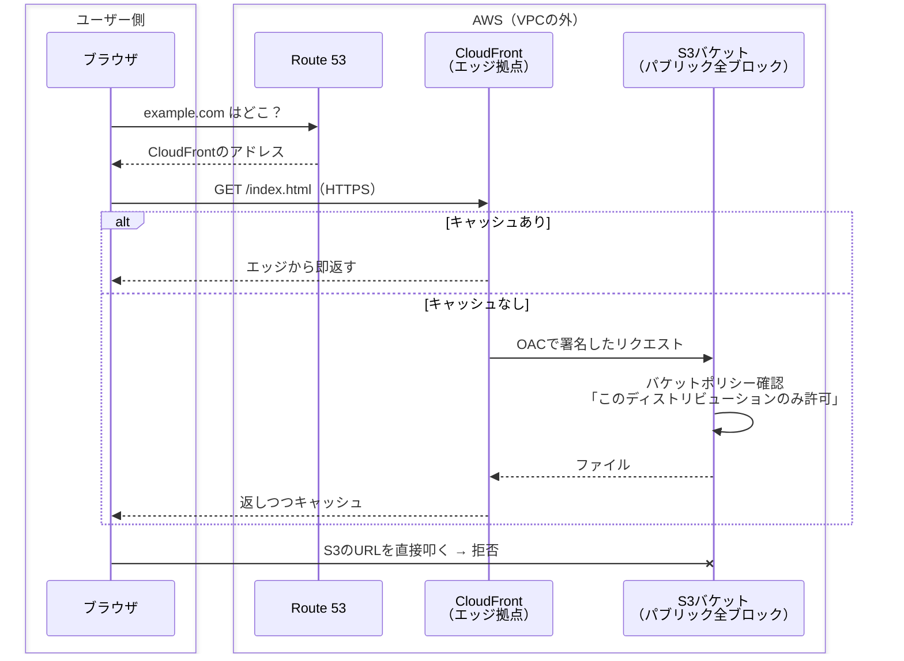
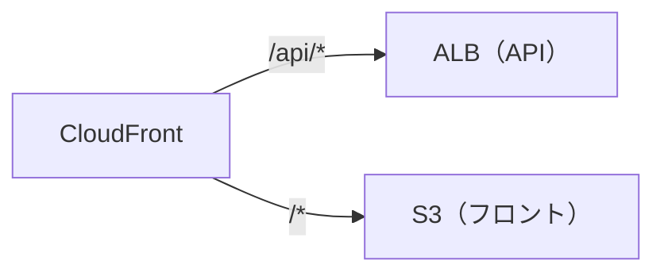

# S3 + CloudFront 静的サイト配信（OAC）

## 概要
S3を非公開のまま、CloudFront経由でだけ静的ファイルを配信する構成。OACは「CloudFrontだけがS3を読める」ようにして抜け道を塞ぐ仕組み。

## 理解したこと

### 全体像



---

### S3単体で公開しない理由

| | S3単体で公開 | CloudFrontを前に置く |
|---|---|---|
| バケット | 誰でも見られる状態にする | 非公開のまま |
| HTTPS（独自ドメイン） | 使えない | ACM証明書で使える |
| 速度 | 1リージョンに集中 | エッジのキャッシュから返す |
| WAF | 付けられない | 付けられる |

---

### OACの許可はバケットポリシーに書く

OACは旧方式OAIの後継。署名付きで来た「特定のディストリビューション」だけを許可する。

```json
{
  "Effect": "Allow",
  "Principal": { "Service": "cloudfront.amazonaws.com" },
  "Action": "s3:GetObject",
  "Resource": "arn:aws:s3:::my-bucket/*",
  "Condition": {
    "StringEquals": { "AWS:SourceArn": "arn:aws:cloudfront::123456789012:distribution/EXXXX" }
  }
}
```

---

### CloudFrontで入口を1つにまとめる

フロントとAPIを分けても、パスでオリジンを振り分ければ同一ドメインにできる。CORS設定が不要になり、WAFも1か所で済む。



---

## 関連概念
- [aws_web_three_tier.md](aws_web_three_tier.md)（API側の構成。「外に見せるのは入口だけ」が共通の考え方）
- [aws_vpc.md](aws_vpc.md)（S3・CloudFrontはVPCの外にいるサービス）
- [static_dynamic_content.md](static_dynamic_content.md)（この構成が扱うのは静的コンテンツ）
- [dns.md](dns.md)（Route 53による名前解決）
- [https.md](https.md)（CloudFrontで独自ドメインのHTTPSを終端する）

## ソース
- 2026-09-29・https://www.c3index.co.jp/blog/blog_3145/
- 2026-09-29・https://note.com/ren_webstep/n/n22b2b94971fb

## タグ
AWS, S3, CloudFront, OAC, OAI, CDN, 静的サイト, バケットポリシー, WAF, SPA, CORS
