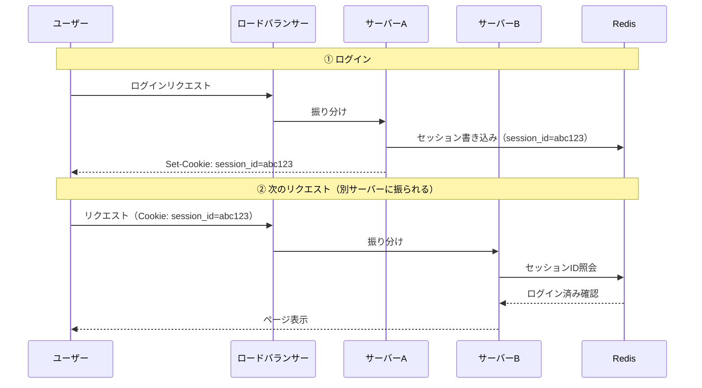

# セッション管理

## 概要
ユーザーのログイン状態をサーバー間で共有・維持するための設計と仕組み。分散サーバー環境で必須の概念。

## 理解したこと

### セッション消失問題
ロードバランサーが異なるサーバーにリクエストを振ると、前のサーバーが持っていたセッション情報が引き継がれず強制ログアウトが起きる。

### 解決策1：IPハッシュによるセッション固定
同一ユーザーを常に同じサーバーに振ることでセッションを維持する。  
弱点：NATで複数ユーザーが同一IPを共有する場合に負荷が偏る・サーバー追加時に再配置が起きる。

### 解決策2：外部セッションストア（推奨）
ステートレス設計に移行し、セッション情報を全サーバーから共通アクセスできる外部ストア（Redis等）に保存する。

### CookieによるセッションIDの転送
1. サーバーがレスポンスヘッダーに `Set-Cookie: session_id=abc123` を付ける
2. ブラウザはCookieストレージに保存し、以降そのドメイン宛のリクエストに自動付与する
3. サーバーはリクエストヘッダーのIDを読んでセッションストアに問い合わせる

> イメージ：サーバーとブラウザの間でIDだけが書かれた「引換券」をやりとりしている

### RedisのSPOF（単一障害点）問題
Redisが停止すると全ユーザーのセッション情報が消え、全員強制ログアウトになる。  
対策：
- **レプリケーション**：スレーブRedisを用意し、メイン障害時に切り替える
- **Redis Cluster**：データを複数ノードに分散し、1台停止でもカバーできる
- **マネージドサービス**：AWS ElastiCache等を使うとクラウド側が冗長化を管理してくれる

### JWTによるステートレス認証（Redisなし）
JWT（JSON Web Token）はログイン情報を暗号化してブラウザ側に持たせる方式。サーバーはセッションストアへの問い合わせが不要になり、完全なステートレスを実現できる。

**トレードオフ**：一度発行したJWTをサーバー側から強制無効化するのが難しい。  
無効化リストをRedisで管理する実装もあるが、それではRedis依存が戻ってしまう。

## 関連概念
- load_balancer.md
- oauth2.md
- short_lived_token.md

## ソース
- 書籍：イラスト図解式ネットワークの基本　第5章（2026-05-14）

## タグ
セッション管理, Cookie, Redis, JWT, ステートレス, SPOF, 認証
