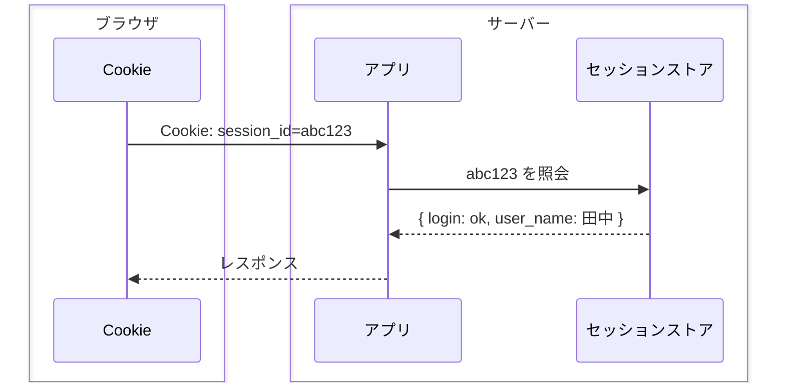
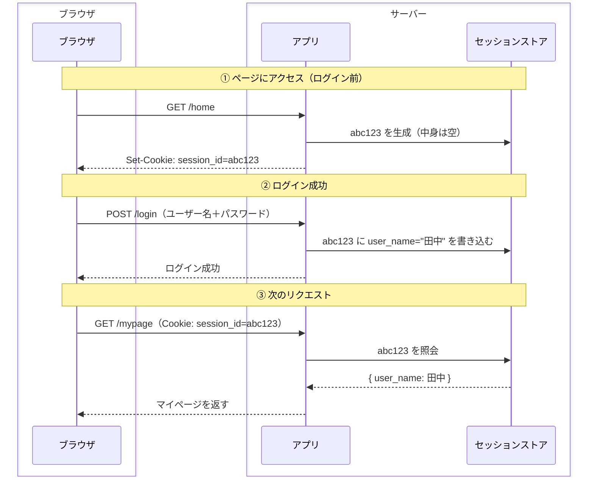

# セッション管理

## 概要
サーバーがブラウザを識別するための仕組み。HTTPはステートレスなため、複数リクエストをまたいで「この人は誰か」を記憶する手段として使う。

## 理解したこと

### セッションの本質
HTTPは各リクエストが独立しており、サーバーは何も覚えない。

「ログイン情報を管理する仕組み」と思いがちだが、本質は**サーバーがブラウザを識別すること**。ログイン情報はその「中身」の話にすぎない。

---

### Cookie とセッションストアの分担

| | 場所 | 持つもの |
|---|---|---|
| Cookie | ブラウザ | セッションID（番号だけ） |
| セッションストア | サーバー | 実際のデータ |

Cookie はセッションIDを運ぶ手段にすぎない。セッションの中身はサーバーが持つ。


```mermaid
sequenceDiagram
    box ブラウザ
        participant C as Cookie
    end
    box サーバー
        participant S as アプリ
        participant St as セッションストア
    end

    C->>S: Cookie: session_id=abc123
    S->>St: abc123 を照会
    St-->>S: { login: ok, user_name: 田中 }
    S-->>C: レスポンス
```

---

### セッションIDの発行タイミング

セッションIDはサーバーが生成し、`Set-Cookie` ヘッダーでブラウザに渡す。ブラウザはもらったIDを保管して送り返すだけ。


```mermaid
sequenceDiagram
    box ブラウザ
        participant B as ブラウザ
    end
    box サーバー
        participant S as アプリ
        participant St as セッションストア
    end

    Note over B,St: ① ページにアクセス（ログイン前）
    B->>S: GET /home
    S->>St: abc123 を生成（中身は空）
    S-->>B: Set-Cookie: session_id=abc123

    Note over B,St: ② ログイン成功
    B->>S: POST /login（ユーザー名＋パスワード）
    S->>St: abc123 に user_name="田中" を書き込む
    S-->>B: ログイン成功

    Note over B,St: ③ 次のリクエスト
    B->>S: GET /mypage（Cookie: session_id=abc123）
    S->>St: abc123 を照会
    St-->>S: { user_name: 田中 }
    S-->>B: マイページを返す
```

セッションIDはログイン前から存在するが、**ユーザー情報と紐づいた abc123** をブラウザが持つのはログイン成功後。

---

### セッション内のデータ構造（二層構造）

キーと値は二段階ある：

```
┌─ セッションストア ──────────────────────────┐
│ "abc123" → { "login"    : "ok"          │
│              "user_name": "田中"  }     │
└────────────────────────────────────────┘
    外側キー       内側キー    内側の値
```

外側キー（セッションID）はフレームワークが自動管理。内側キーを `SetString` / `GetString` で操作する。

パスワードはセッションに保存しない。ログイン照合後に捨て、ユーザーを特定する情報だけを残す。

---

### ログインフラグパターン（ASP.NET Core）

入門的な実装では、ユーザー名とは別に明示的なログインフラグを持つことがある：

```csharp
// ログイン成功時
HttpContext.Session.SetString("login", "ok");
HttpContext.Session.SetString("user_name", "田中");

// 各ページでの認証チェック
if (HttpContext.Session.GetString("login") != "ok")
{
    return RedirectToAction("Login");
}
```

ユーザー名の有無だけで判定もできるが、フラグを別に持つと判定ロジックが明示的になる。

---

### セッション操作の使い分け（ASP.NET Core）

| 操作 | メソッド | セッションID | 中身 |
|---|---|---|---|
| 特定キーだけ削除 | `Remove("key")` | 残る | 指定キーだけ消える |
| 全データ削除 | `Clear()` | 残る | 空 `{}` になる |
| セッション破棄 | `SignOutAsync()` + Cookie削除 | 無効化 | 消える |

`Clear()` だけではIDが残るため、完全なログアウトには Cookie の無効化も必要。

---

### 外部セッションストア（分散環境での推奨解決策）

- セッション消失問題・解決策1（IPハッシュ）→ `load_balancer.md`
- 外部ストアの実装・SPOF問題・対策 → `redis.md`

---

### JWTによるステートレス認証（Redisなし）
JWT（JSON Web Token）はログイン情報を暗号化してブラウザ側に持たせる方式。サーバーはセッションストアへの問い合わせが不要になり、完全なステートレスを実現できる。

**トレードオフ**：一度発行したJWTをサーバー側から強制無効化するのが難しい。無効化リストをRedisで管理する実装もあるが、それではRedis依存が戻ってしまう。

---

## 関連概念
- load_balancer.md（分散環境でのセッション消失問題と解決策が繋がる）
- redis.md（外部セッションストアの実装として使う）
- oauth2.md（外部サービスへの認可委譲。セッション管理とは別レイヤー）
- short_lived_token.md（JWTの無効化問題への対策として繋がる）

## ソース
- 書籍：イラスト図解式ネットワークの基本　第5章（2026-05-14）
- ASP.NET Core MVC での実装を通じた壁打ち（2026-06-06）

## タグ
セッション管理, Cookie, セッションストア, セッションID, Redis, JWT, ステートレス, SPOF, 認証, ASP.NET Core
