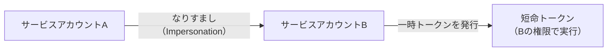

# 短命トークン（Short-lived Token）

## 概要
必要なときだけ発行され、短時間で自動失効する使い捨ての認証情報。

## 理解したこと

### 永続的APIキーとの違い

| | 永続的APIキー（.env） | 短命トークン |
|--|--|--|
| 有効期限 | 無期限 | 1時間以内など短期 |
| 漏洩時のリスク | 放置すると永続的に悪用される | 失効すれば無効になる |
| 存在タイミング | 常に存在する | 呼び出されて初めて発行される |
| 設計思想 | 漏らさない設計 | 漏れても大丈夫な設計 |

「金庫の鍵を管理会社から必要なときだけ借りる」イメージ。AWSではSTS（Security Token Service）が発行する。

多層防御：**短命トークン + IPアドレス制限 + 最小権限スコープ** の3点セットで被害を最小化。

### 権限借用（Impersonation）との関係

権限借用は「短命トークンをどうやって取得するか」の手段。GCPではJSONキー（永続・固定パスワード）の代わりに権限借用を使うのがベストプラクティス。

「鍵を渡す」のではなく「都度通行証を発行する」イメージ。

### 混同ポイント

SSH鍵認証と混同しやすい（どちらも「安全な認証」という印象）。根本的な違いは**鍵の有無**：

| | SSH鍵認証 | 短命トークン |
|--|--|--|
| 認証の仕組み | 暗号鍵ペアで署名 | ただの文字列 |
| 安全の根拠 | 秘密鍵が漏れない設計 | 短時間で自動失効する設計 |
| 設計思想 | 漏らさない | 漏れても大丈夫 |

## 関連概念
- ssh_key_auth.md（「漏らさない設計」との対比）
- personal_access_token.md
- cloud_infrastructure.md（GCPでの権限借用の実例）
- threat-model-assumption-collapse（人間スケールの漏洩前提が機械スケール攻撃で崩れた事例）

## ソース
- 2026-03-08・Zenn「「.env見るな」は通じない－AI時代のシークレット管理術」
  https://zenn.dev/76hata/articles/d6d9de62d001a8
- 2026-03-16・https://zenn.dev/so_engineer/articles/728f4336a0aac4

## タグ
認証, セキュリティ, AWS, STS, シークレット管理, AIエージェント, GCP, 権限借用, Impersonation
