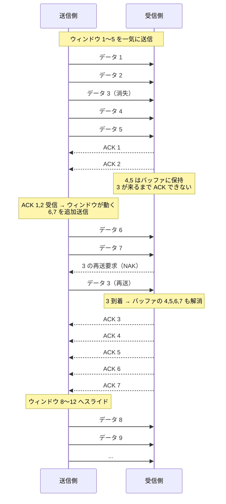

# スライディングウィンドウ

## 概要
TCPにおけるフロー制御の仕組みで、速度と信頼性を両立するプロトコル。

## 理解したこと
- ウィンドウサイズ分のデータ（例：1〜5）を ACK 確認なしで一気に送る → 速度
- 順序通り（1→2→3…）にしか ACK は進まない → 信頼性
- 欠損があるとそこで ACK が詰まる。欠損が埋まった瞬間、バッファされていた分が一気に解消されてスライドする
- ウィンドウは「全部揃ってから」ではなく、ACK が届くたびに少しずつスライドし続ける
- 「一気に送る × 順序保証で待つ」の組み合わせが速度と信頼性の両立を実現している

## 用語定義

| 用語 | 正式名称 | 意味 |
|------|----------|------|
| SYN | Synchronize | 接続要求。「通信を始めたい」という合図 |
| ACK | Acknowledgement | 確認応答。「受け取った」という合図 |
| NAK | Negative Acknowledgement | 否定応答。「届いていない、再送して」という合図 |
| FIN | Finish | 切断要求。「通信を終わりにしたい」という合図 |

## 構成図

<!-- イラスト図解式ネットワークの基本 第2章 / 2026-04-01 -->

## 関連概念
- tcp_ip_model

## ソース
- 2026-04-01：イラスト図解式ネットワークの基本 第2章

## タグ
TCP, フロー制御, ネットワーク, プロトコル, 信頼性
