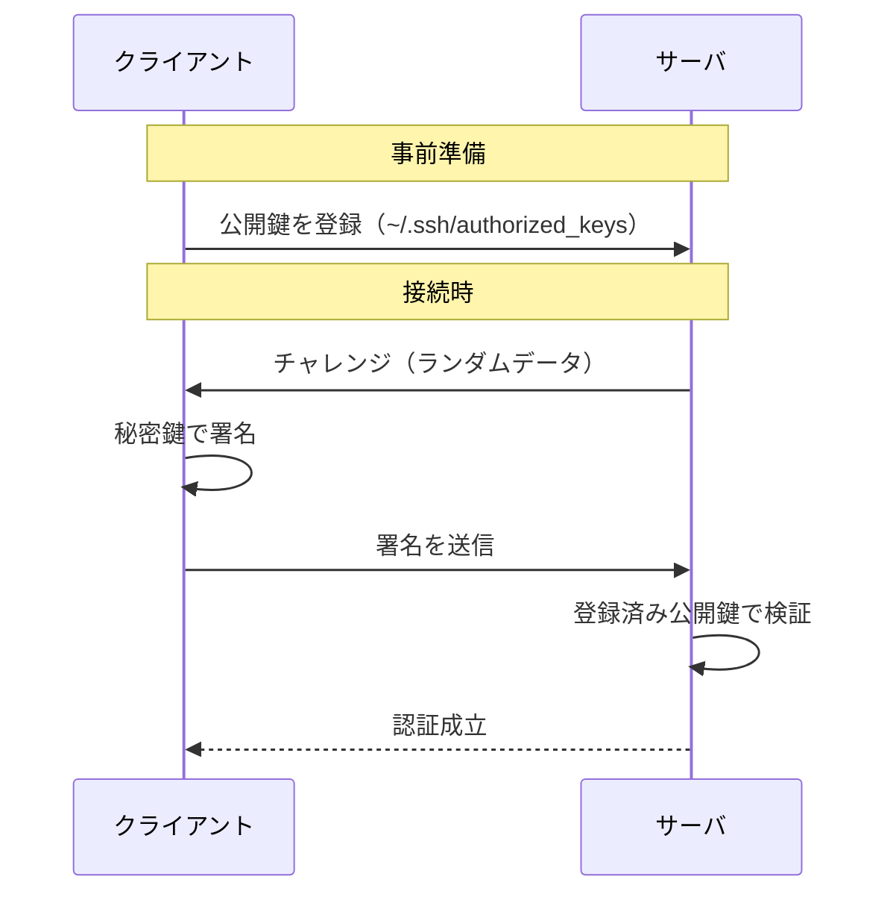

# SSH（Secure Shell）

## 概要
サーバやネットワーク機器にリモート接続してCUI操作するためのプロトコル・プログラム。ポート22番。

## なぜ必要か
前身のTelnetは暗号化なし・認証が弱く、通信内容の盗聴やなりすましのリスクがあった。SSHはその改善版として、暗号化と公開鍵認証の2つを備える。

## 2つのセキュリティ機構

| 機構 | 目的 |
|---|---|
| 通信の暗号化 | 通信内容が盗聴されない |
| 公開鍵認証 | パスワード総当たりが通用しない |

## 公開鍵認証の流れ

## 鍵の使い方の2方向

| 用途 | ロック（送信側） | 解錠（受信側） | 秘密鍵の保持者 |
|---|---|---|---|
| 認証（SSH） | 秘密鍵で署名 | 公開鍵で検証 | クライアント |
| 暗号化 | 公開鍵でロック | 秘密鍵で復号 | サーバ |

## HTTPSとの比較（Git接続での使い分け）

| | HTTPS | SSH |
|---|---|---|
| 暗号化の仕組み | HTTP + TLS（ssl_tls.md） | SSH独自の暗号化 |
| 実装ライブラリ | OpenSSL or GnuTLS | OpenSSH |
| 認証 | PAT（パスワード的なトークン） | 公開鍵認証 |
| ポート | 443 | 22 |

- HTTPSはTLSを使う。UbuntuデフォルトのGitはGnuTLSを使用しており、バッファ溢れ時に接続を切断する既知の弱点がある
- Gitは大量ファイルを「packfile」として1塊で送るため、GnuTLSと相性が悪い
- SSHはOpenSSHを使いGnuTLSを一切通らないため、この問題を根本回避できる
- さらにSSHはストリーム接続のためチャンク分割のオーバーヘッドが少ない

## 関連概念
- ssl_tls.md（TLSの仕組み・GnuTLS/OpenSSLの位置付け）
- ssh_key_auth.md（公開鍵認証の詳細・印鑑の比喩）
- ftp.md（同じくアプリケーション層の遠隔操作系。SFTPはSSHの上で動く）
- chunk_and_overhead.md（ストリーム接続の利点を理解するための前提）

## ソース
- 2026-05-08・イラスト図解式ネットワークの基本 第5章
- 2026-05-08・Qiita「AI時代にすべてをGitHubで管理するあなたへ──HTTPS接続、今すぐやめてください」
  https://qiita.com/kenimo49/items/27e2a11e80fe3b835f96

## タグ
SSH, セキュリティ, リモートアクセス, 公開鍵暗号, 認証, 暗号化, Telnet, HTTPS, Git, GnuTLS
