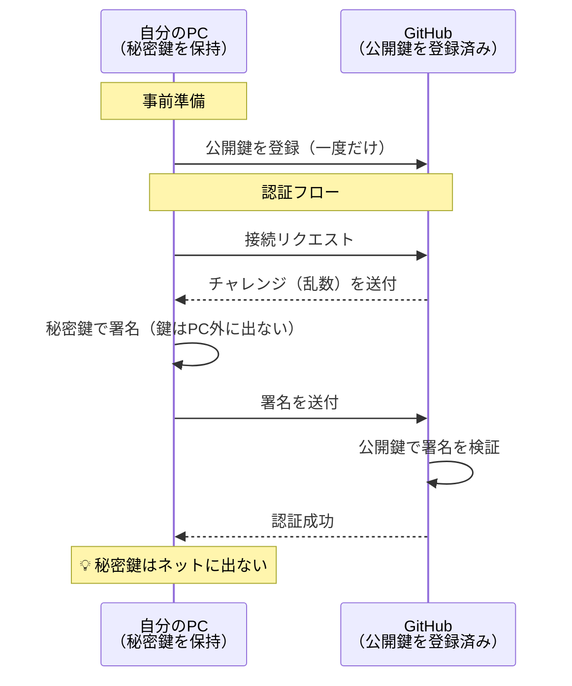

# SSH鍵認証（公開鍵・秘密鍵）

## 概要
数学的に対になった鍵ペアを使い、秘密鍵をPC外に出さずに認証する仕組み。

## 理解したこと
- **秘密鍵**：自分のPCにだけ保存（`~/.ssh/id_ed25519`）。絶対に外に出さない
- **公開鍵**：GitHubなどに登録（漏れても問題ない）
- 認証するとき、秘密鍵で「署名」するだけ。秘密鍵自体はネットに出ない
- PATと違い、認証情報をファイルに書き出す必要がない
- AIエージェントが作業しても秘密鍵はAIのコンテキストに入らない → 漏洩リスクが低い
- **印鑑の比喩**：PATは「合言葉を直接渡す」、SSH鍵は「印鑑を押す（印鑑自体は渡さない）」
- 大容量ファイルの転送もHTTPS(GnuTLS)より安定している

## 構成図

<!-- 2026-03-30 -->

## 関連概念
- personal_access_token.md（HTTPS認証との比較）
- challenge_response_auth.md（署名がなぜ安全かの仕組み）

## ソース
- 2026-03-06・Qiita「AI時代にすべてをGitHubで管理するあなたへ──HTTPS接続、今すぐやめてください」
  https://qiita.com/kenimo49/items/27e2a11e80fe3b835f96

## タグ
認証, SSH, セキュリティ, 公開鍵暗号, GitHub
