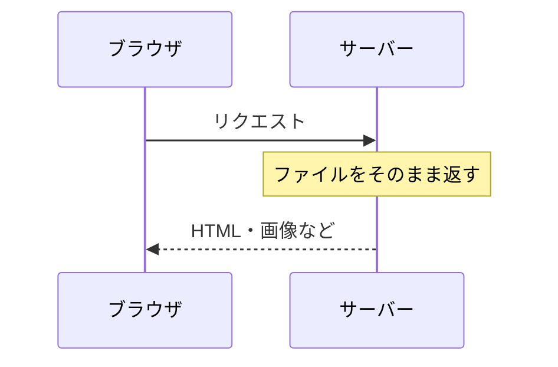
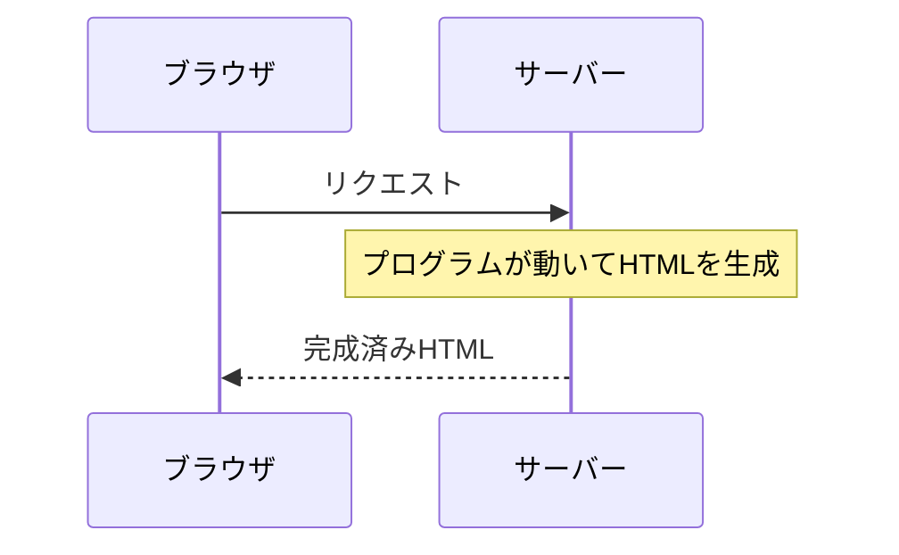
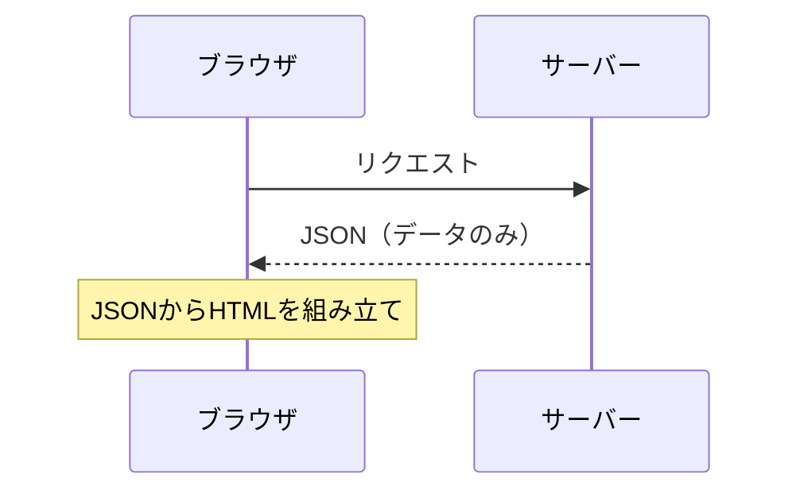

# 静的コンテンツと動的コンテンツ

## 概要
Webサーバーがクライアントに返すコンテンツの生成方式の違い。

## 理解したこと

### 静的コンテンツ

あらかじめ作ってあるファイルをそのまま返す。

---

### 動的コンテンツ（SSR）

リクエストのたびにサーバー側でHTMLを組み立てて返す。

---

### 動的コンテンツ（SPA）

サーバーはJSONのみ返し、ブラウザ側でHTMLを組み立てる。

---

### まとめ

| | サーバーが返すもの | HTMLの組み立て場所 | 例 |
|---|---|---|---|
| 静的 | 事前作成済みファイル | なし | 画像・固定ページ |
| 動的（SSR） | 完成済みHTML | サーバー | ASP.NET MVC |
| 動的（SPA） | JSON | ブラウザ | React, Vue |

---

## 関連概念
- application_layer_protocols（HTTPなどコンテンツを配信するプロトコルが属する層）
- client_server_vs_p2p（静的・動的コンテンツはクライアント/サーバーモデルで配信される）
- url（リクエスト先を特定するための識別子）
- dom（サーバーから受け取ったHTMLをブラウザがDOMとして解釈・構築する）

## ソース
- 2026-05-01：イラスト図解式ネットワークの基本 第5章
- 会話ベース 2026-06-10

## タグ
静的コンテンツ, 動的コンテンツ, SSR, SPA, Web, サーバー, React
