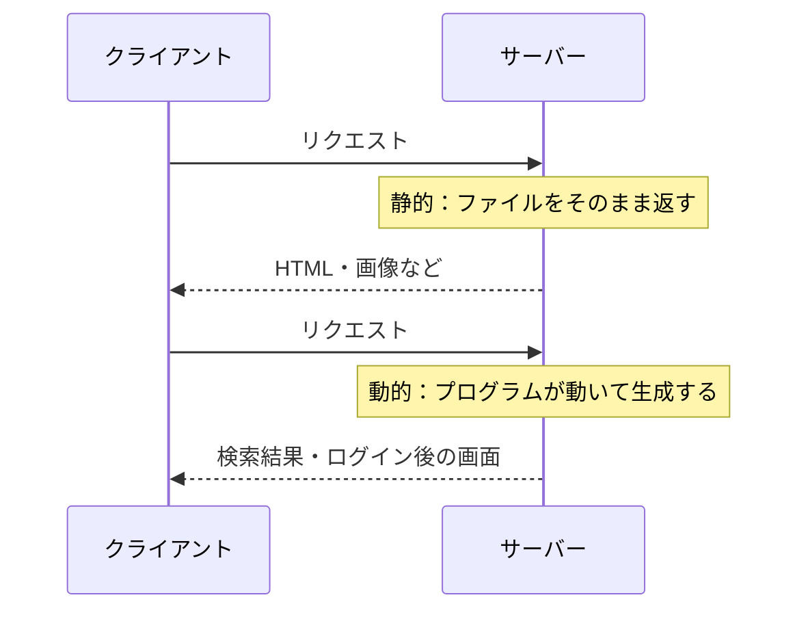
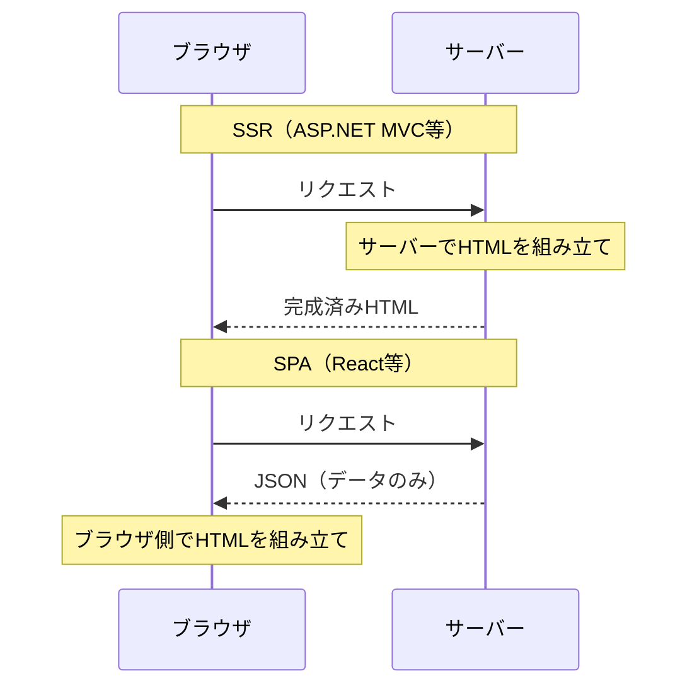

# 静的コンテンツと動的コンテンツ

## 概要
Webサーバーがクライアントに返すコンテンツの生成方式の違い。

## 理解したこと

### 静的 vs 動的

---

### SSR vs SPA

「どこでHTMLを組み立てるか」の違い。

---

## 関連概念
- application_layer_protocols（HTTPなどコンテンツを配信するプロトコルが属する層）
- client_server_vs_p2p（静的・動的コンテンツはクライアント/サーバーモデルで配信される）
- url（リクエスト先を特定するための識別子）
- dom（サーバーから受け取ったHTMLをブラウザがDOMとして解釈・構築する）

## ソース
- 2026-05-01：イラスト図解式ネットワークの基本 第5章

## タグ
静的コンテンツ, 動的コンテンツ, Web, サーバー
