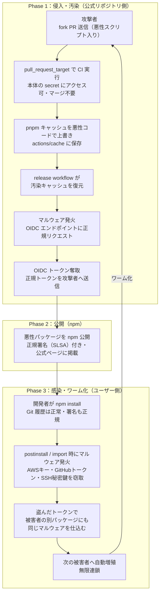

# サプライチェーン攻撃（Supply Chain Attack）

## 概要
攻撃対象を直接狙わず、信頼された第三者（ライブラリ・ツール・取引先）を踏み台にして侵入する攻撃手法。

## 理解したこと

### 共通の本質
- 直接攻撃より検知が難しい。「信頼済み」の経路を使うため正規の通信に見える
- コードレビューや監査では防げないケースがある（ソースが綺麗でもビルド成果物が汚染されている場合）

### 形態の進化

| 世代 | 手口 | 防衛線 |
|------|------|--------|
| 旧来型 | 悪性パッケージを別名で公開・typosquatting | パッケージ名の確認・lockfile |
| OAuth侵害型 | サードパーティ経由でOAuthトークンを奪取（Vercel 2026/04） | 最小権限OAuth・ローテーション |
| ワーム型（最新） | CI/CDを踏み台に正規パスで公開→感染端末から次のパッケージへ自己増殖（TanStack 2026/05） | キャッシュ分離・権限最小化・依存遅延更新 |

### TanStack事件（Mini Shai-Hulud）の攻撃フロー

### 「信頼の連鎖が武器にされた」構造
| 信頼の根拠 | 状態 |
|-----------|------|
| Git 履歴 | 汚れていない（ソースは正規） |
| SLSA 署名 | 付いている（正規パイプラインで発行） |
| 公式 npm ページ | 本物のページに掲載 |
| OIDC トークン | 正規トークン（パイプライン内で正当に発行） |

→ 4つすべてが同時に無効化された

### OAuth侵害型の対策
1. OAuthは最小権限で連携する（Allow All は絶対に使わない）
2. シークレットのローテーションを定期的に行う
3. 連携済みサービスのアクティビティログを定期監査
4. サードパーティのセキュリティ体制も選定基準に含める

## 関連概念
- ci_cd（CI/CDパイプライン自体が攻撃対象になる）
- github_actions_security（pull_request_target・キャッシュ汚染がワーム型の根本原因）
- secure_by_default
- attack_surface_management
- vibe_coding_security

## ソース
- 2026-04-22・https://qiita.com/sakutto-panda/items/4f7ed746d702fad257e3
- 2026-06-03・https://zenn.dev/trknhr/articles/69c01c843329d0

## タグ
セキュリティ, サプライチェーン攻撃, OAuth, 最小権限, インシデント, TanStack, ワーム型, OIDC, キャッシュ汚染
