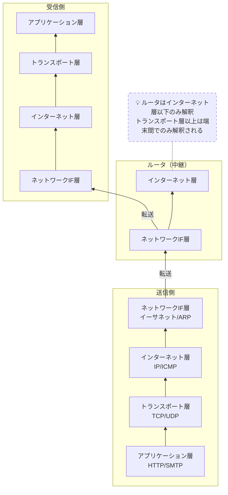
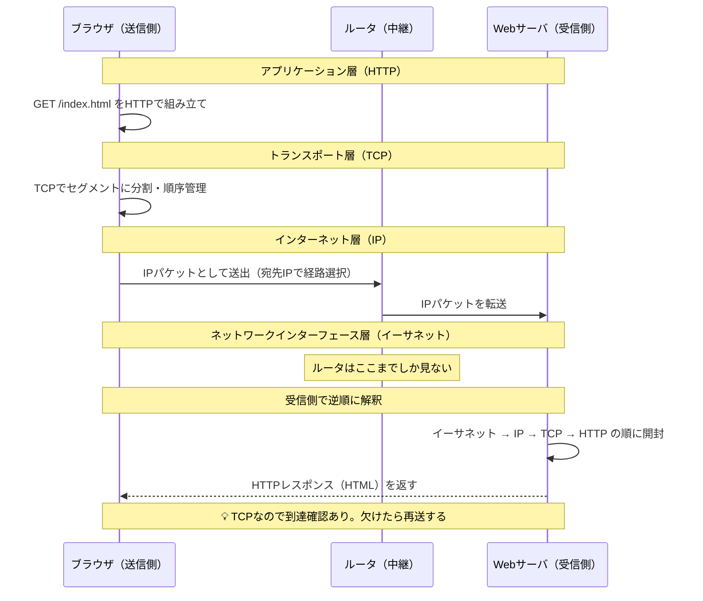

# TCP/IPモデル

## 概要
インターネット通信の事実上の標準プロトコル群を4層で整理したモデル。OSI参照モデルの後継的存在。

## 理解したこと

| 層 | 役割 | 主なプロトコル | OSI対応 |
|----|------|---------------|---------|
| アプリケーション層 | 具体的な通信サービスを実現 | HTTP, SMTP, POP3 | L5〜L7 |
| トランスポート層 | 目的に応じた通信品質を実現 | TCP, UDP | L4 |
| インターネット層 | 中継により任意の機器同士の通信を実現 | IP, ICMP | L3 |
| ネットワークインターフェース層 | 直接接続された機器同士の通信を実現 | イーサネット, ARP, RARP | L1〜L2 |

- OSIの上位3層（セッション・プレゼンテーション・アプリケーション）→ アプリケーション層1つに集約
- OSIの下位2層（データリンク・物理）→ ネットワークインターフェース層1つに集約
- 基本思想はOSIと同じ：下位層の機能を上位層が利用する積み重ね構造
- 送信時は上の層から順にラッピング（カプセル化）し、受信時は下から順に剥がしていく
- 各層のラッピングは同じ層の機器しか剥がせない。ルータはインターネット層までしか剥がさないため、TCPやHTTPの中身は見えない
- これがエンドツーエンドの秘匿性の根拠でもある
  - エンドツーエンド＝「両端の端末間」。中継するルータが何台あっても内容は両端にしか見えない
  - ただし平文HTTPは暗号化されていないので、パケットキャプチャで中身を読むことは可能。本当の秘匿性はHTTPSなどアプリ層の暗号化まで含めて初めて保証される
- TCP/IPはクライアントサーバ型・P2P型どちらの構成でも使われる通信基盤。どちらの構成かはアーキテクチャの話であり、TCP/IPはその下で共通して動く

## 構成図

<!-- イラスト図解式ネットワークの基本 2章 / 2026-03-30 -->

## 具体例：ブラウザでWebページを取得する流れ

<!-- イラスト図解式ネットワークの基本 2章 / 2026-03-30 -->

## 関連概念
- osi_model.md
- communication_protocol.md
- internetworking.md
- layered_architecture.md

## ソース
- 2026-03-30・「イラスト図解式 ネットワークの基本」第2章

## タグ
ネットワーク, TCP/IP, プロトコル, レイヤー, インフラ
