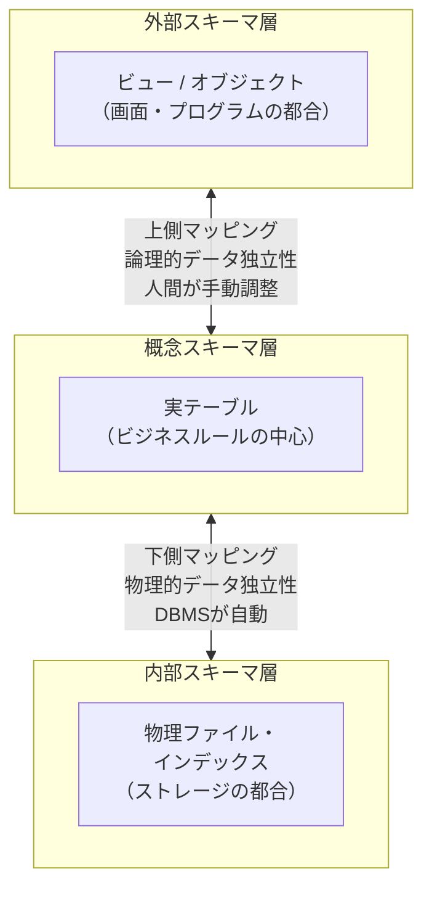

# 3層スキーマ

## 概要
外部・概念・内部の3層でDBの構造を分離し、マッピングで緩く繋ぐアーキテクチャ。どこかを変更してもマッピングを調整するだけで、システム全体を壊さずに運用できる。

## 3層の役割

| 層 | 実体 | 役割 |
|---|---|---|
| 外部スキーマ | ビュー（覗き窓） | 画面・ユーザーの都合に合わせてデータを切り出す |
| 概念スキーマ | 実際のテーブル | ビジネスルールの中心。画面・物理ファイルの都合に振り回されない背骨 |
| 内部スキーマ | 物理ファイル・設定 | インデックスや配置でストレージ性能を引き出す |

## マッピングとデータ独立性

3層は直接結びつくのではなく「マッピング（パス）」で緩く繋がっている。
どこかが変わってもパスの繋ぎ先を変えるだけで済む（＝データの独立性）。

| マッピング | 繋ぐ層 | 独立性の名前 | 調整担当 |
|---|---|---|---|
| 下側 | 内部 ⇄ 概念 | 物理的データ独立性 | DBMS が自動 |
| 上側 | 概念 ⇄ 外部 | 論理的データ独立性 | 人間が手動（DBA・バックエンドエンジニア） |

## 変更時の動き（上側マッピングの例）

テーブルを分割するとき：
1. DBAまたはバックエンドエンジニアがテーブルを変更
2. 同じ担当者が即座にビューを調整し、外部から見た形（元のテーブル名）を維持
3. フロントエンド・アプリ側のプログラマーは変更を知らずにそのまま動く

DBの構造を変えた人が責任を持ってマッピングを調整する、という分業ルールが前提。

## 設計3ステップとの対応

3層スキーマは「完成したDBの構造」を表す概念。それを作るための手順が設計3ステップ。

| 設計ステップ | 対応するスキーマ |
|---|---|
| 論理設計 | 概念スキーマ |
| 物理設計 | 内部スキーマ |
| 実装フェーズ | 外部スキーマ（テーブル完成後にビューを作成） |

外部スキーマは設計3ステップの外——テーブルが出来上がった後、アプリの要求に応じて実装フェーズで作られる。

## 関連概念
- dbms
- db_design
- normalization

## ソース
- 2026-05-25：達人DB 第1章
- 2026-05-27：達人DB 第2章

## タグ
3層スキーマ, データ独立性, 物理的データ独立性, 論理的データ独立性, 外部スキーマ, 概念スキーマ, 内部スキーマ, マッピング, ビュー, DB設計
