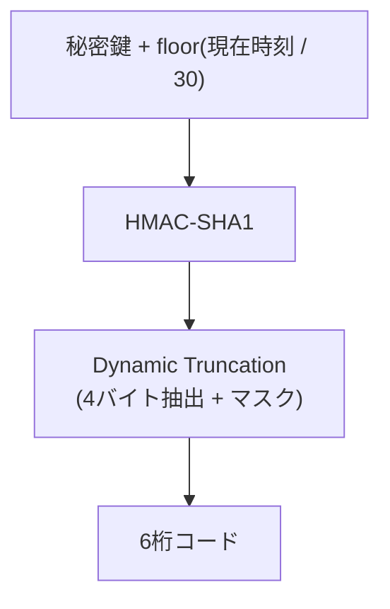

# TOTP (Time-based One-Time Password)

## 概要
秘密鍵と現在時刻から、サーバーとクライアントが通信せずに独立して同じ使い捨てコードを計算する認証方式(RFC 6238)。

## 理解したこと

### 仕組み: 時刻をカウンタにしたHOTP

HOTP(RFC 4226)の「カウンタ」を「30秒ごとに増える時刻」に置き換えたのがTOTP。サーバーとクライアントは通信せず、同じ計算を独立に行って結果を比較するだけ。

---

### 秘密鍵共有のリスク

| 漏洩ポイント | 内容 | 対策 |
|--|--|--|
| 配布時(QRコード表示) | 秘密鍵を初めて見せる瞬間。フィッシングサイトによるすり替えも理論上ありえる | HTTPS + 認証済みセッション、一度きり表示 |
| 保存時(サーバーDB) | 検証のたびに再計算が必要なため、秘密鍵を復元可能な形で保持する必要がある | KMS等の別鍵で暗号化して保存 |

パスワードは「照合はできるが復元はできない」ハッシュ化で守れるが、TOTPの秘密鍵はそれができない。ここがTOTPの構造的な限界。

---

### 他のOTP方式との比較

| 方式 | 秘密の在り処 | 代表例 | 主な弱点 |
|--|--|--|--|
| SMS/メールOTP | 事前共有なし。都度サーバーがランダム値を生成 | 各種Webサービスの2段階認証 | SIMスワップ・SS7傍受など通信キャリア依存の攻撃に弱い |
| TOTPアプリ | 登録時に秘密鍵を共有し、以降は独立計算 | Google Authenticator, Authy | 配布時・保存時の秘密鍵漏洩リスク |
| プッシュ通知型 | 鍵ペアを生成し秘密鍵は端末内 | Duo, Okta Verify | MFA疲労攻撃(考えずに承認してしまう) |
| WebAuthn/パスキー | 鍵ペアを生成し秘密鍵は端末外に一切出ない | Google/Apple、銀行系 | 現状もっとも強いが、デバイス紛失時の代替手段設計が課題 |

---

### WebAuthn/FIDO2との違い(対称鍵 vs 非対称鍵)

| | TOTP | WebAuthn/FIDO2 |
|--|--|--|
| 鍵の種類 | 対称鍵(共有秘密) | 非対称鍵(鍵ペア) |
| 秘密鍵の所在 | サーバーとクライアント両方 | クライアント(認証器)のみ、外に出ない |
| DB漏洩時の影響 | 秘密鍵が漏れ、コード生成が可能になる | 公開鍵しかないため悪用不可 |
| フィッシング耐性 | なし(6桁の数字は誰にでも転送できる) | あり(署名対象にoriginが含まれドメインに束縛される) |

---

### 実装して初めて気づいたこと

仕様書レベルでは「HMACして切り詰めるだけ」に見えるが、実際に手を動かすとRFCがビット単位の操作(符号ビットのマスク、バイト列とintの相互変換)まで厳密に規定していることに気づく。理屈として理解済みでも、実装では1つでも順序や方向(encode/decodeなど)を間違えると即座に壊れる。

エラーが出ずに動いたことは「正しい」ことの証明にはならない。テストした経路にたまたまバグのある処理が含まれていなかっただけ、というケースがあった(詳細は関連実装のREADME参照)。

## 関連概念
- [challenge_response_auth.md](challenge_response_auth.md) — WebAuthnは秘密鍵自体を渡さず署名で証明する、チャレンジ・レスポンスの一種
- [hash.md](hash.md) — HMACはハッシュ関数を土台にした仕組み
- [authentication_authorization.md](authentication_authorization.md) — OTPは認証(あなたは誰か)を実現する手段の一つ

## 関連実装
- [totp_minimal](../coding/totp_minimal/) — RFC 6238のTOTPを標準ライブラリのみで最小実装し、Authenticatorアプリと突き合わせて検証した

## ソース
- 2026-08-22：会話ベース(/code 壁打ち)

## タグ
認証, セキュリティ, OTP, TOTP, HMAC, RFC6238, ワンタイムパスワード, WebAuthn, FIDO2, MFA
