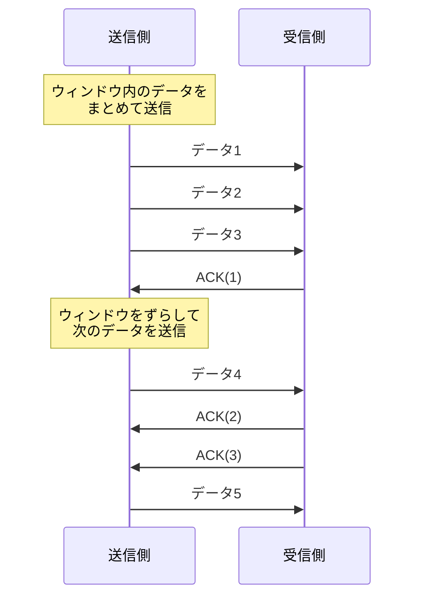
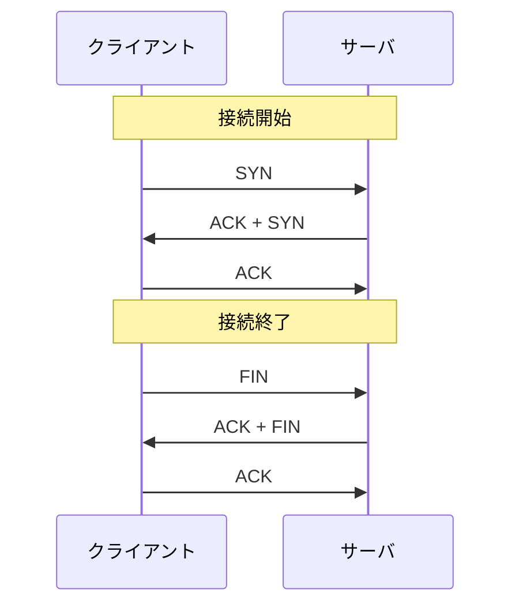
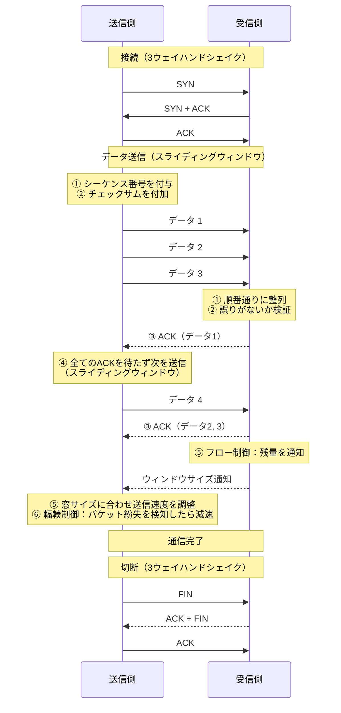

# トランスポート層

## 概要
TCP/IPモデルの第2層。インターネット層が作る任意コンピュータ間の通信をベースに、用途に応じた通信特性を実現する。

## 理解したこと
- インターネット層が「届ける」機能を作り、トランスポート層がその上で「どう届けるか」を選べるようにする
- ポート番号を付けることで「どのアプリに届けるか」を特定できる（IPアドレスだけではアプリまで特定できない）

| | TCP | UDP |
|---|---|---|
| 特性 | 信頼性重視 | 速さ重視 |
| 仕組み | 接続を確立してから通信・終了後に切断。確認・再送あり | インターネット層をほぼそのまま利用。確認・再送なし |
| リアルタイム性 | 低い | 高い |
| 用途例 | Webページ取得・メール | 動画ストリーミング・音声通話 |

- UDPが存在する理由：IPを直接使うとポート番号がないためアプリへの振り分けができない。UDPは「IP＋ポート番号だけ足した最小限のプロトコル」
- UDPは接続処理を行わないため、相手が不在の場合はデータがその場で消失する

### ポート番号

- 範囲：0〜65535
- **ウェルノウンポート（0〜1023）**：主要アプリケーション用に予約された番号帯

| ポート番号 | プロトコル | 用途 |
|-----------|-----------|------|
| 80 | HTTP | Webへのアクセス |
| 443 | HTTPS | 暗号化したWebへのアクセス |
| 110 | POP3 | メールボックスの読み出し |
| 143 | IMAP4 | メールボックスへのアクセス |
| 25 | SMTP | サーバー間のメール転送 |
| 587 | SMTP submission | PCからサーバへのメール送信 |
| 20 | FTP data | ファイル転送（データ転送用） |
| 21 | FTP control | ファイル転送（制御用） |

- **クライアント側ポート**：通信開始側も1つのポートを使用する。1024以降の番号が自動で割り当てられる

### 通信の4タプル

TCP・UDP共通で、通信を一意に識別するために以下の4つの情報を使用する：

```
自身のIPアドレス ＋ 自身のポート番号 ＋ 相手のIPアドレス ＋ 相手のポート番号
```

### TCPが信頼性を高める6つの処理

1. **シーケンス番号** — データに番号を付けて順序を保証する
2. **誤り検出** — 受信データに誤りがないか確認する
3. **肯定確認応答（ACK）** — 相手が受け取ったかを確認する
4. **スライディングウィンドウ** — ACKを待たず一定範囲のデータをまとめて送ることで効率化する。未着データの再送要請も行う
5. **フロー制御** — 受信側のペースに合わせた送信速度の調整
6. **輻輳制御** — ネットワークの混雑状況に応じた送信速度の調整

### スライディングウィンドウ


### 3ウェイハンドシェイク

TCPは通信の開始・終了時にハンドシェイクを行う。



## 全体像

<!-- 2026-04-05・「イラスト図解式 ネットワークの基本」第2章 -->


## 関連概念
- internet_layer.md
- tcp_ip_model.md
- client_server_vs_p2p.md
- network_identifiers.md

## ソース
- 2026-03-30・「イラスト図解式 ネットワークの基本」第2章
- 2026-03-31・「イラスト図解式 ネットワークの基本」第2章
- 2026-04-05・「イラスト図解式 ネットワークの基本」第2章

## タグ
ネットワーク, TCP, UDP, トランスポート層, ポート番号, ウェルノウンポート, インフラ, スライディングウィンドウ, 3ウェイハンドシェイク
