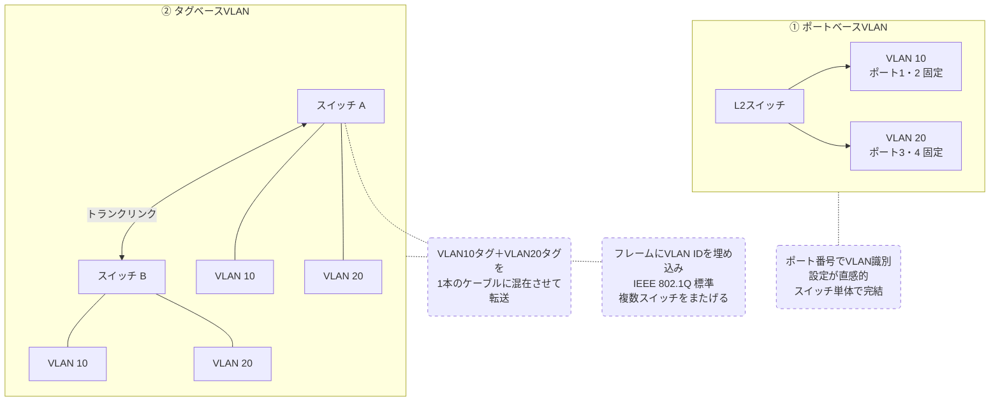

# VLAN（仮想LAN）

## 概要
物理的な接続に関わらず、ネットワークを論理的に分割する仕組み。

## 理解したこと
- 社内ネットワークを部署ごとに分けるなどの用途で使われる
- 同じスイッチに接続していても、別VLANの機器は直接通信できない
- VLAN同士をつなぐにはL3スイッチが必要（→ l3_switch.md）

### VLAN分割の方式
- **ポートベースVLAN**：物理ポートにVLAN IDを固定する方式。設定が直感的でわかりやすい
- **タグベースVLAN**：フレームにVLAN IDタグを埋め込む方式。IEEE 802.1Q標準規格。1本のケーブルやポートで複数VLANを共有（トランク）できるのが最大の強み
- 現実の構成では両方を組み合わせて使うことが多い

### タグの動作
- スイッチは受信フレームのタグを確認し、対応するVLAN専用のMACアドレステーブルを参照して転送先を決める
- MACアドレステーブルへの機器登録時もタグが活用される（VLANごとにテーブルが分かれて管理される）
- 宛先ポートにフレームを届ける直前にタグを外す

### L2/L3とVLANの関係
- VLAN内の通信はL2スイッチで完結する
- 異なるVLAN間の通信にはL3スイッチのルーティング機能が必要
- L3スイッチは社内VLAN間の高速転送が得意だが、NAT/NAPTは苦手
- インターネット向けのグローバルIP/プライベートIP変換はルーターが担う

## 関連概念
- l3_switch.md
- hub_and_switch.md
- lan_wan.md

## 構成図

<!-- イラスト図解式ネットワークの基本 第4章 壁打ちセッション 2026-04-30 -->

## ソース
- 2026-04-27：書籍「イラスト図解式ネットワークの基本」第4章
- 2026-04-30：書籍「イラスト図解式ネットワークの基本」第4章（壁打ちセッション）

## タグ
VLAN, 仮想LAN, ネットワーク分割, LAN, L2スイッチ, IEEE 802.1Q, タグベースVLAN, ポートベースVLAN, トランク, NAT, NAPT

