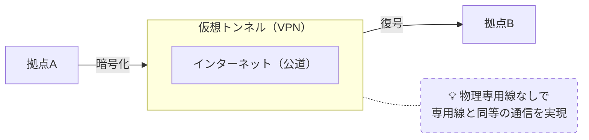

# VPN（仮想専用線）

## 概要
インターネット（公道）に仮想的なトンネルを作り、専用線のような通信を実現する技術。

## 理解したこと
- 仮想 Private Network の略
- 物理的な専用線を引かなくても、インターネット上に「自分専用のトンネル」を作れる
- 物理的なリソース制約がないため、コスト効率よく専用線的な通信を実現できる
- インターネットVPNはパブリックな回線を使うため暗号化が必須

### 利用シーン
- **LAN型**：拠点同士のLANをつなぐ（例：本社と支社）
- **リモート型**：外出先の個人デバイスから社内LANに接続する
- LANに接続する際はVPNゲートウェイ（入口となる専用機器）を通過する必要がある

### トンネル技術
VPNの「通路」を作る技術。データを別のパケットで包んで送ることで仮想の経路を実現する。
暗号化は担当しない（あくまで道を作るだけ）。

| プロトコル | 状態 |
|---|---|
| PPTP | 事実上引退。セキュリティ上問題あり |
| L2TP/IPsec | 現役標準。迷ったらこれ |
| SSL-VPN | 新勢力。ファイアウォール越えに強い |
| WireGuard | 新勢力。シンプルで高速 |

### IPsec（暗号化プロトコル）
トンネル内のデータを守る役割を担う。3つのプロトコルで構成される。

- **IKE**：暗号鍵を交換するプロトコル
- **ESP**：データを暗号化してやり取りする仕組み。AHの機能も包含する上位互換
- **AH**：認証と改ざん検知を行う仕組み。IPヘッダまで厳密に確認するためNATのIP書き換えと相性が悪く、現代では事実上不使用

実質的な組み合わせ：**IKE + ESP**

## 構成図

<!-- イラスト図解式ネットワークの基本 1章 / 2026-03-30 -->

## 関連概念
- wan_connection_types.md
- intranet_extranet.md
- vlan.md

## ソース
- 2026-03-28：書籍「イラスト図解式 ネットワークの基本」第1章
- 2026-04-30：書籍「イラスト図解式ネットワークの基本」第4章（壁打ちセッション）

## タグ
ネットワーク, VPN, WAN, セキュリティ, インフラ, IPsec, IKE, ESP, AH, トンネル, L2TP, WireGuard, SSL-VPN
