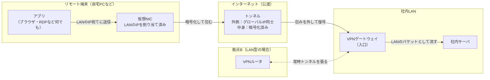

# VPN（仮想専用線）

## 概要
インターネット（公道）に仮想的なトンネルを作り、物理的には離れた場所にいながら論理的にはそのLANの一員として通信できるようにする技術。

## 理解したこと

### 全体像

元のパケット（LANのIPのまま）を暗号化して外側のパケットで包み、インターネットを通過させる。

VPNゲートウェイは包みを外して復号するだけで、中身をそのままLANに流す。


```mermaid
flowchart LR
    subgraph Home["リモート端末（自宅PCなど）"]
        App["アプリ<br/>（ブラウザ・RDPなど何でも）"]
        VNIC["仮想NIC<br/>LANのIPを割り当て済み"]
    end
    subgraph Internet["インターネット（公道）"]
        Tunnel["トンネル<br/>外側：グローバルIP同士<br/>中身：暗号化済み"]
    end
    subgraph Corp["社内LAN"]
        GW["VPNゲートウェイ<br/>（入口）"]
        Server["社内サーバ"]
    end
    subgraph Site["拠点B（LAN型の場合）"]
        Router["VPNルータ"]
    end

    App -->|LANのIP宛てに送信| VNIC
    VNIC -->|暗号化して包む| Tunnel
    Tunnel -->|包みを外して復号| GW
    GW -->|LANのパケットとして流す| Server
    Router <-.->|常時トンネルを張る| GW
```

---

### 「VPNに接続する」とは

トンネルの出口がある側のネットワークに、自分の通信を属させること。

出口がどこにあるかで意味が変わる。

| 種類 | 出口 | 何が起きるか |
|---|---|---|
| リモート型 | 社内LANのVPNゲートウェイ | 端末にLANのIPが割り当てられ、LANの一員になる（＝LANに入る） |
| LAN型（拠点間） | 相手拠点のVPNルータ | ルータ同士が常時接続するため、人が「接続する」操作はない |
| 市販VPNサービス | VPN事業者のサーバ | LANには入らず、別の場所からインターネットに出る（経路の秘匿・IPを隠す） |

スプリットトンネルを設定すると、社内宛ての通信だけをトンネルに通し、それ以外は自宅回線から直接出すこともできる。

---

### パケットは二重構造（置き換えではなく包む）

インターネットを通過する間は暗号化されていて、ゲートウェイで包みを外すと最初から書かれていたLANのIPが現れる。

```
[外側] 送信元: 自宅のグローバルIP → 宛先: VPNゲートウェイのグローバルIP
  [中身・暗号化] 送信元: 10.0.5.20 → 宛先: 10.0.1.10（LANのIPのまま）
```

| | NAT | VPN（トンネル） |
|---|---|---|
| やること | IPヘッダを書き換える | 元のパケットを丸ごと包む |
| 元のIP | 消える（置き換わる） | 中身にそのまま保持される |

---

### トンネルと暗号化の分担

トンネル技術は「道を作るだけ」で、暗号化は別のプロトコルに任せるものと、両方を一体で行うものがある。

| 方式 | トンネル | 暗号化 | 状態 |
|---|---|---|---|
| PPTP | PPTP | 弱い独自方式 | 事実上引退。セキュリティ上問題あり |
| L2TP/IPsec | L2TP | IPsec | 現役標準。拠点間ではIPsecが定番 |
| SSL-VPN | TLS（一体） | TLS（一体） | リモート型の主流。ファイアウォール越えに強い |
| WireGuard | 独自（一体） | 独自（一体） | 新勢力。シンプルで高速 |

---

### IPsec（暗号化プロトコル）

トンネル内のデータを守る役割。IPパケット全体を対象にネットワーク層で暗号化する。

| プロトコル | 役割 | 現状 |
|---|---|---|
| IKE | 暗号鍵を交換する | 必須 |
| ESP | データを暗号化する。AHの機能も含む上位互換 | 必須 |
| AH | 認証と改ざん検知。IPヘッダまで検査する | NATのIP書き換えと相性が悪く、事実上使われない |

実際に使われる組み合わせは **IKE + ESP**。

---

### IPsecとTLSの違い（なぜSSL-VPNがあるのか）

暗号化の仕組み（鍵交換して共通鍵で暗号化）はほぼ同じで、違うのは「どの層で、どの範囲を包むか」。

| | TLS（HTTPSなど） | IPsec |
|---|---|---|
| 層 | アプリ寄り（TCPの上） | ネットワーク層（IP） |
| 守る範囲 | アプリの接続1本ずつ | 端末のすべてのIP通信 |
| アプリ側の対応 | TLSへの対応が必要 | 意識しなくてよい |
| VPNとしての強み | 443番ポートを使うため、ファイアウォールやNATを越えやすい | 全通信をまとめて運べるため、LANの一員になる目的に合う |

VPNの目的は「LANの一員になる」ことなので、本来はIP層で包むIPsecが向いている。

ファイアウォールを越えやすいという利点を取るなら、TLSでトンネルを作る（SSL-VPN）。

---

## 関連概念
- [wan_connection_types.md](wan_connection_types.md)（インターネットVPN・通信業者VPNは拠点間接続方式の選択肢）
- [intranet_extranet.md](intranet_extranet.md)（VPNで社外から社内ネットワークに参加する）
- [vlan.md](vlan.md)（物理構成と切り離して論理的なネットワークを作る点が共通）
- [nat_napt.md](nat_napt.md)（NATは「書き換え」、VPNは「包む」。AHが使われない理由もNATにある）
- [encapsulation.md](encapsulation.md)（トンネルはパケットを別のパケットで包むカプセル化の応用）
- [ssl_tls.md](ssl_tls.md)（SSL-VPNのトンネル兼暗号化に使われる。IPsecとは暗号化する層と範囲が違う）

## ソース
- 2026-03-28：書籍「イラスト図解式 ネットワークの基本」第1章
- 2026-04-30：書籍「イラスト図解式ネットワークの基本」第4章（壁打ちセッション）
- 2026-10-09：/recall からの壁打ち（VPN接続の意味・二重構造・TLSとの違い）

## タグ
ネットワーク, VPN, WAN, セキュリティ, インフラ, IPsec, IKE, ESP, AH, トンネル, L2TP, WireGuard, SSL-VPN, TLS, カプセル化, リモートアクセス, スプリットトンネル
