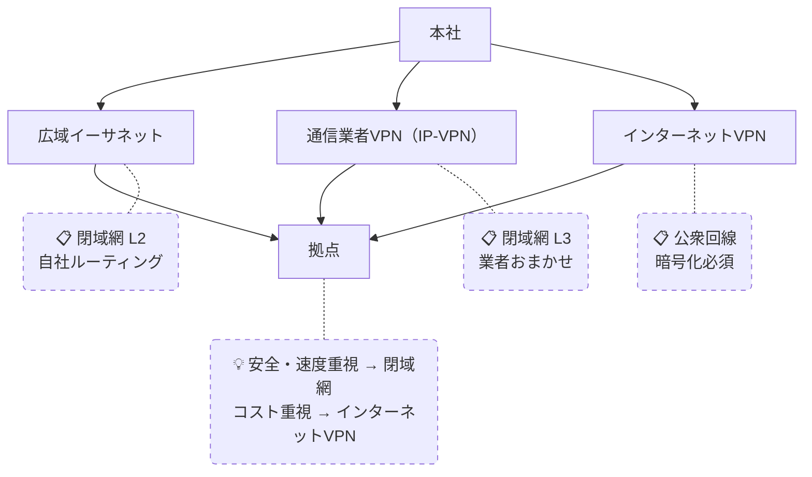

# WAN接続方式

## 概要
拠点間をつなぐWANの接続方式。広域イーサネット・通信業者VPN・インターネットVPNの3種類があり、安全性・速度・料金でトレードオフがある。

## 理解したこと
- **広域イーサネット**：通信業者の閉域網をレイヤー2（回線のみ）で借りる。ルーティングは自社で設定。自由度が高い分、技術力が必要。大企業向け
- **通信業者VPN（IP-VPN）**：レイヤー3まで含めて通信業者におまかせ。MPLSで論理分離された閉域網を利用。最も一般的
- **インターネットVPN**：パブリックなインターネットを経由するため暗号化が必須。安全性はそこそこ、速度は状況次第だが料金が安い

| | 安全性 | 速度 | 料金 | 管理 |
|---|---|---|---|---|
| 広域イーサネット | 高 | 速い | 高い | 自社（L2） |
| 通信業者VPN | 高 | 速い | 高い | 業者（L3） |
| インターネットVPN | そこそこ | 状況次第 | 安い | 自社＋暗号化 |

## 構成図

<!-- イラスト図解式ネットワークの基本 1章 / 2026-03-30 -->

## 関連概念
- lan_wan.md

## ソース
- 2026-03-28・「イラスト図解式 ネットワークの基本」第1章

## タグ
ネットワーク, WAN, VPN, インフラ
