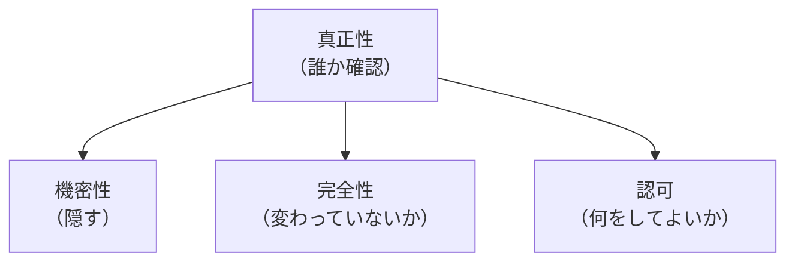

# 真正性が土台になる構造

## 捉えるもの
「誰か」を確認する真正性が保証されなければ、機密性・完全性・認可といった後続の保護や判断がすべて意味を失う。一見別物に見える複数のセキュリティ技術領域に、同じ骨格が繰り返し現れる。

## 構造

### 共通パターン

機密性・完全性・認可はそれぞれ別々の問いに答えるが、どれも「相手が誰か」が確定していることを前提にしている。真正性がなければ、守るべき境界線そのものが定義できない。

---

### 各ドメインでの現れ方

| ドメイン | 真正性の実現手段 | 真正性がないと何が崩れるか |
|---|---|---|
| ネットワーク通信（PKI/TLS） | CAによる証明書の署名 | MITM攻撃で鍵をすり替えられ、機密性（暗号化）ごと無効化される |
| メール（SPF/DKIM/DMARC） | 送信ドメイン認証 | 送信元を偽装され、内容の信頼性そのものが崩れる |
| ハッシュ＋デジタル署名 | 秘密鍵による署名 | ハッシュ単体（完全性）は誰でも計算できるため、本人証明にならない |
| アプリケーションのログイン | 認証（本人確認） | 誰か確定しないと、認可（権限判断）が実行できない |

---

### なぜ真正性だけが特別か
機密性・完全性・認可は「データや権限の状態」を扱う仕組みであり、それぞれ独立した問いに答える。

一方、真正性が確定しているからこそ「誰から誰へ」の境界線が定まり、その境界線の内側で初めて「隠す」「改ざんを検知する」「権限を与える」が意味を持つ。真正性は他の性質と並列の一要素ではなく、他の性質が成立するための前提条件という、一段違う役割を持つ。

## ソース
- 2026-08-17・書籍「イラスト図解式 セキュリティの基本」第2章の学習から、`/study` → `/connect` での壁打ちで発見

## 関連概念
- [pki.md](../concepts/pki.md) — MITM攻撃で機密性が無効化される具体例
- [sender_domain_auth.md](../concepts/sender_domain_auth.md) — メールにおける真正性の実現手段
- [digital_signature.md](../concepts/digital_signature.md) — 完全性(ハッシュ)と真正性(署名)の違い
- [authentication_authorization.md](../concepts/authentication_authorization.md) — 認証(真正性)が認可の前提になる関係
- [information_security_properties.md](../concepts/information_security_properties.md) — 真正性を含む情報セキュリティ7要素の全体像

## タグ
真正性, 機密性, 完全性, 認可, PKI, 送信ドメイン認証, デジタル署名, セキュリティ, 信頼
