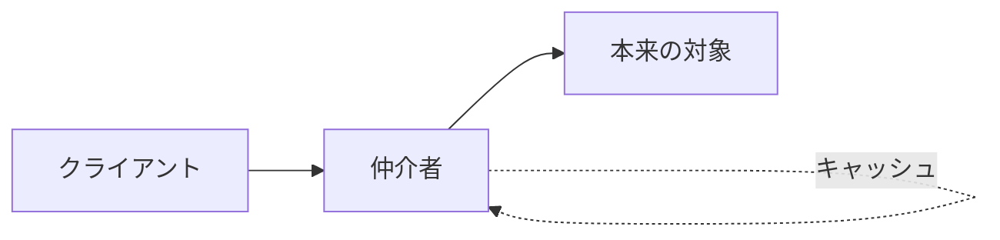

# インダイレクション（間接参照）という普遍的解法

## 捉えるもの
「間に一層挟む」だけで、効率化・セキュリティ・隠蔽・制御という複数の問題を同時に解決できるというコンピュータサイエンス全体を貫く原則。

## 関連概念
- [http_proxy.md](../concepts/http_proxy.md) — ネットワーク（HTTP）
- [dns.md](../concepts/dns.md) — ネットワーク（名前解決）
- [nat_napt.md](../concepts/nat_napt.md) — ネットワーク（アドレス変換）
- [rag.md](../concepts/rag.md) — AI（知識への間接参照）

## 構造

### 格言
> "All problems in computer science can be solved by another level of indirection."
> — David Wheeler

### 間に挟むことで得られるもの

| 得られるもの | 具体例 |
|--|--|
| 効率化 | キャッシュで再取得・再計算を省く |
| セキュリティ | 通信をフィルタリング・監視できる |
| 隠蔽（抽象化） | 裏側の複雑さをクライアントに見せない |
| 制御 | アクセス先・通信内容をコントロールできる |

### 各ドメインでの現れ方

| ドメイン | 仲介者 | 隠しているもの |
|--|--|--|
| HTTPプロキシ | プロキシサーバ | Webサーバの場所・通信の複雑さ |
| DNS | キャッシュサーバ | コンテンツサーバの階層構造 |
| 仮想メモリ | MMU（メモリ管理ユニット） | 物理アドレス |
| API | インターフェース | 実装の詳細 |
| CDN | エッジサーバ | オリジンサーバの場所 |
| ロードバランサー | LB | サーバ台数・構成 |
| RAG | Retrieval層 | ベクトルDBの検索複雑さ |

### 共通する構造

クライアントは仲介者を「本来の対象」だと思って使う。仲介者は両側に異なる顔を持つ。

## ソース
- 2026-05-12：/study「イラスト図解式ネットワークの基礎 第5章」→ /connect での壁打ちから発見
